****
# День 1. Управление виртуальным ЦОД 

Понятие виртуализации (от Virtual - действительный, лат.) в широком смысле представляет собой сокрытие настоящей реализации какого-либо объекта или процесса от истинного его представления для пользователя. Результатом виртуализации является нечто удобное для использования, на самом деле, имеющее более сложную или совсем иную структуру, отличную от той, которая воспринимается при работе с объектом. Происходит отделение представления от реализации. В компьютерных технологиях под термином «виртуализация» обычно понимается абстракция вычислительных ресурсов (чаще всего серверов) и предоставление пользователю системы, которая «инкапсулирует» (скрывает в себе) собственную реализацию. Проще говоря, пользователь работает с удобным для себя представлением объекта, и для него не имеет значения, как объект устроен в действительности.

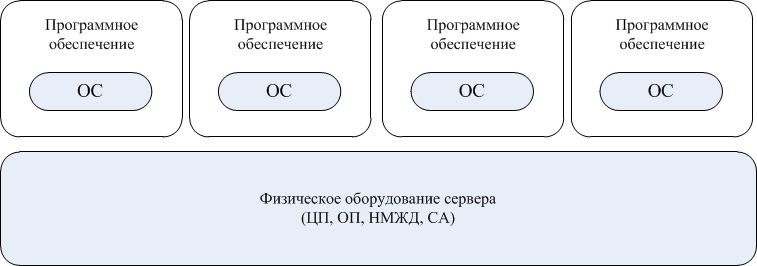
**Виртуальные машины, работающие на физическом оборудовании**

Долгое время в центрах обработки данных стремились к децентрализованной архитектуре, масштабированию приложений и системной инфраструктуры в горизонтальном направлении. Эта тенденция, как правило, приводила к росту числа серверов. Со временем инфраструктура ЦОД становилась все более сложной, что сказывалось на возможности его модернизации, обслуживании, стоимости и пр. Централизованная архитектура может уменьшить количество серверов и увеличить степень использования оборудования при сравнимой производительности, а также уменьшить стоимость владения оборудованием. 

`Частичная виртуализация` (нативная виртуализация) базируется на принципе эмуляции только необходимого количества ресурсов, чтобы виртуальная машина могла быть запущена изолировано. Напротив, при `полной эмуляции` различных архитектур, гостевая система работает с определенной специфической системой команд процессора, отличной от системы команд процессора хостовой системы. Каждую команду процессору гостевой системы нужно транслировать в соответствующую команду хостовой системы, что невероятно уменьшает быстродействие.

При использовании нативной виртуализации никакой трансляции команд не происходит, так как гостевая операционная система разработана под ту же архитектуру, на которой работает хостовая система. Это позволяет значительно повысить быстродействие гостевой системы и максимально приблизить его к быстродействию реальной системы.

Для повышения быстродействия нативной виртуализации применяется специализированная программная прослойка – `гипервизор`. Гипервизор является посредником между гостевой операционной системой и физическим аппаратным обеспечением. Он позволяет гостевой системе напрямую обращаться к аппаратным ресурсам, что и является секретом высокого быстродействия данного вида виртуализации. Гипервизор является одним из ключевых понятий в мире виртуализации.

Частичная эмуляция является самым распространенным видом виртуализации в наше время. Основным ее недостатком является зависимость виртуальных машин от конкретной аппаратной архитектуры [3].
Примеры продуктов для частичной эмуляции: `VMware Workstation, VMware Server, VMware ESXI Server, Virtual Iron, Microsoft Hyper-V Server, Microsoft Virtual PC, Sun VirtualBox, Parallels Desktop` и другие.

В хакатоне мы будем использовать ЦОД под управлением гипервизора `ESXi 6.5` и платформы централизованного управления `VMware vCenter`. Вы можете ознакомиться с документацией по `VMware vCenter` [[тут]](https://docs.vmware.com/en/VMware-vSphere/index.html). В комплекте с `vCenter` предоставляется веб-клиент `VMware vSphere Web Client`, с помощью которого можно управлять виртуальной инфраструктурой через один из распространенных браузеров c поддержкой `Flash Player`).

Для выполнения заданий хакатона для каждой команды выделен пул виртуальных ресурсов:

- Оперативная память:  8 ГБ.

- Эквивалентная микропроцессорная частота: 2400 МГц.

- Объем дискового пространства 50 ГБ.

- Доступ во внешнюю сеть VM-Netwotk. 

- Виртуальная локальная сеть team**.

****
## Доступ к виртальному ЦОД 

Для доступа к выделенному для команды пула ресурсов необходимо открыть страницу по адресу:

* [https://195.19.40.127/vsphere-client/?csp](https://195.19.40.127/vsphere-client/?csp)

Для доступа необходимо использовать логин и пароль, предоставленные организаторами хакатона.

**Доступ к VMware vCenter**

После ввода логина и пароля вы на главную административную панель `VMware vSphere Web Client` (т.н. Home).

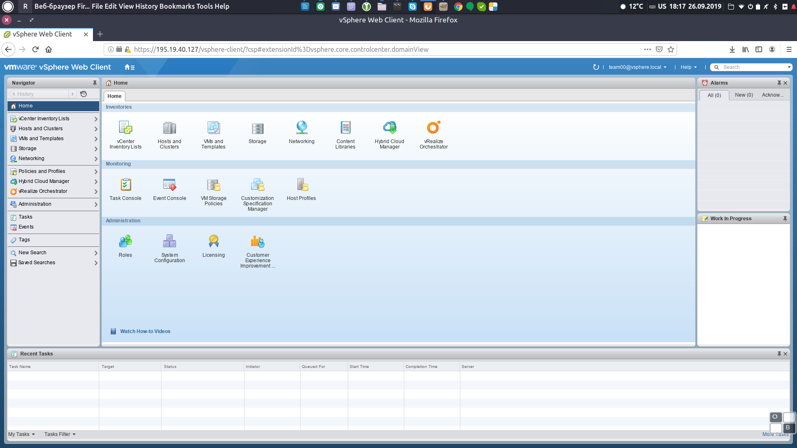
**Главную административную панель `VMware vSphere Web Client`**

При первом входе вам необходимо изменить пароль. 

Войдите в меню **Roles -> Users and Groups**. Выберите в списке вашу команду (team), введите текущий пароль и дважды новый пароль. Требования к сложности пароля: только цифры, не менее 6 цифр.

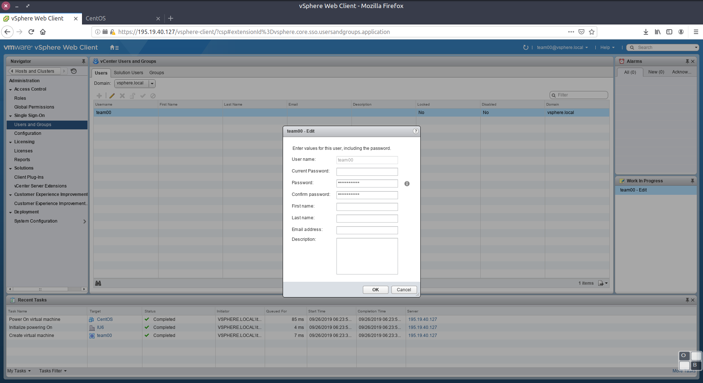

****
## Создание виртуальной машины сетевого шлюза и установка ОС 

Перейдите из главной административной панели в раздел **Hosts and Clasters**.

Иерархия виртуального ЦОД состоит из следующих уровней:

1) Уровень Центра обработки данных: `195.19.40.127`

2) Уровен кластера: `IU6`

3) Уровень хоста: `195.19.40.124` или `195.19.40.125` или `195.19.40.126`. 

4) Уровень консолидированного вычислительного пула (так называемый `Resource Pool`): `team**`.

Дальнейшие действия необходимо производить только на уровне 4). Управление остальными уровнями иерархии выполняется только администратором ЦОД.

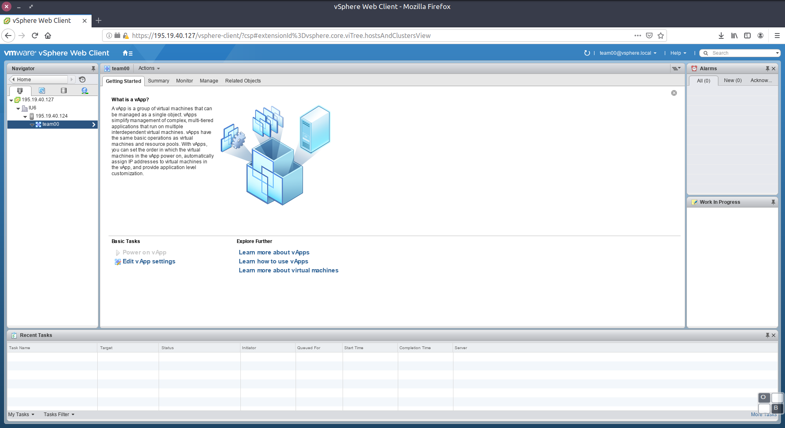
**Иерархия виртуального ЦОД**

Вызовите контекстное меню для вычислительного пула. Выберите пункт **New Virtual Machine**.

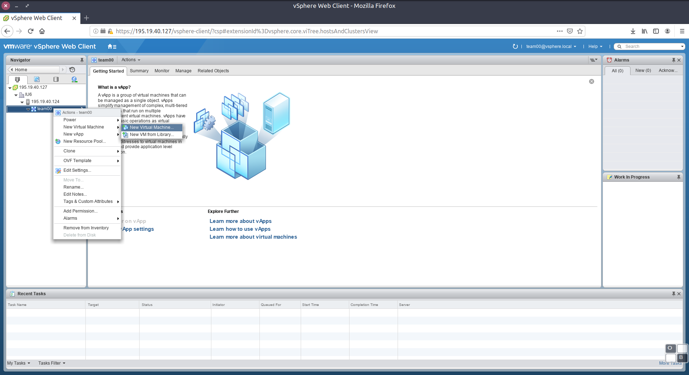
**Создание новой виртуальной машины**

Далее следуйте указаниям диалога. 

В пункте **2a** выберите кластер для развертывания виртуальной машины: `IU6`. 

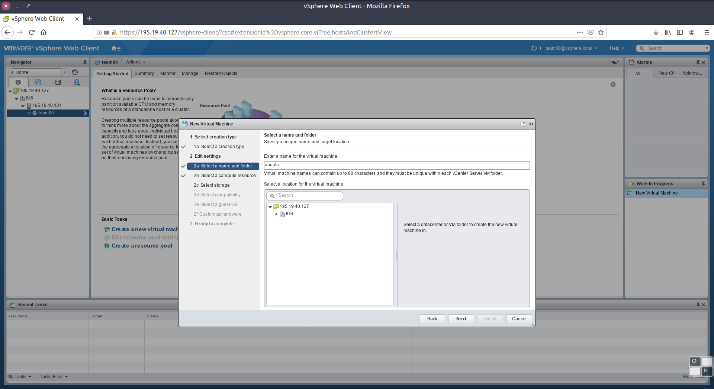

В пункте **2b** выберите вычислительный пул: `team**`. 

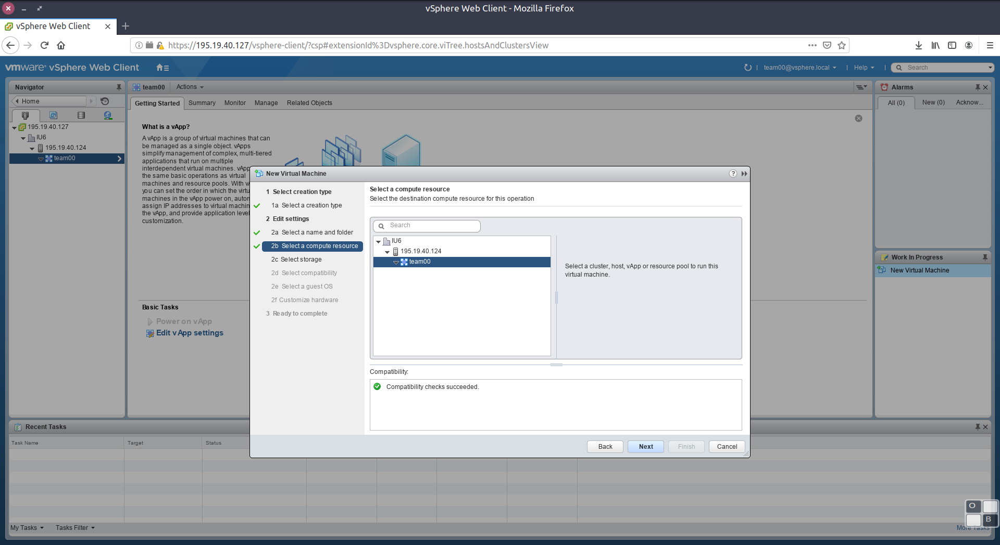

В диалоге выбора ресурсов виртуальной машины выберите следующие ресурсы:

- 1 CPU

- 1 GB RAM

- 10 GB HDD. 

- Две сетевые карты типа `VMXNET 3`, подключенные к сетям `VM-Netwotrk` и `team**`.

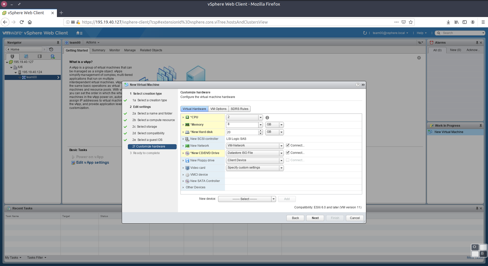

!!!По умолчанию выбирается так называемый Thick (толстый) тип диска. Все пространство такого диска выделяется в момент создания, при этом блоки не очищаются от данных, которые находились там ранее. Это может создавать потенциальные угрозы безопасности, поскольку виртуальная машина может получить доступ к данным на хранилище VMFS, которые ей не принадлежат. При обращении к блокам такого диска их содержимое предварительно не очищается со стороны ESX. Преимущество дисков типа thick - производительность и быстрота создания, недостаток - безопасность

Поэтому мы будем использовать диски типа Thin ("тонкие диски"), позволяющий автоматически расширять занимаемое дисковое пространство по мере заполнения диска. 
Эти диски создаются минимального размера и растут по мере их наполнения данными до выделенного объема. При выделении нового блока - он предварительно очищается. Эти диски наименее производительны (выделение нового блока и его очистка), однако наиболее оптимальны для экономии дискового пространства на системе хранения данных.

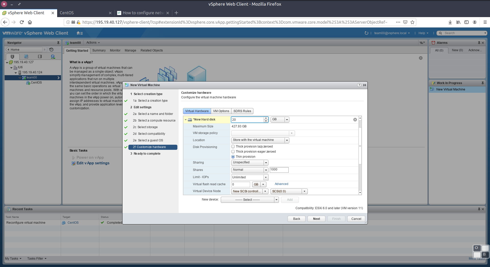

Для установки операционной системы необходимо подключить виртуальный привод CD/DVD и смонтировать в него установочный образ системы. Выберите пункт **Datastore ISO file**. В открывшемся диалоге выберите один из образов Ubuntu в папке **OS_images**. Включите пункт **Connect** для CD/DVD.

!!! Рекомендуется использовать версию ОС Linux без установленного рабочего стола. Например: `Ubuntu-18.04.3-live-server-amd64.iso`. Вы также можете использовать любой другой дистрибутив Linux, имеющийся в папке OS_images или ваш дистрибутив, подключив к CD/DVD файл iso с локального компьютера !!!

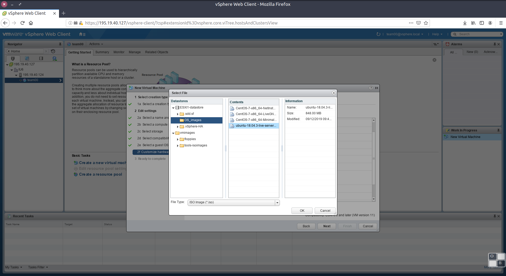

Проверьте параметры ВМ. Создайте виртуальную машину.

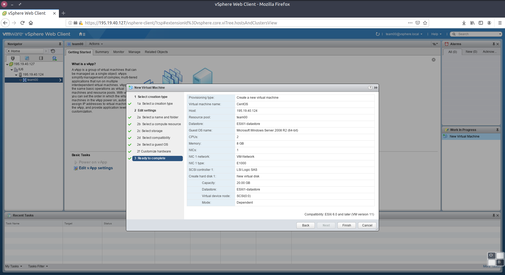

Теперь необходимо установить операционную систему. 

В контекстом меню ВМ выберите пункт **Power -> Power On**.

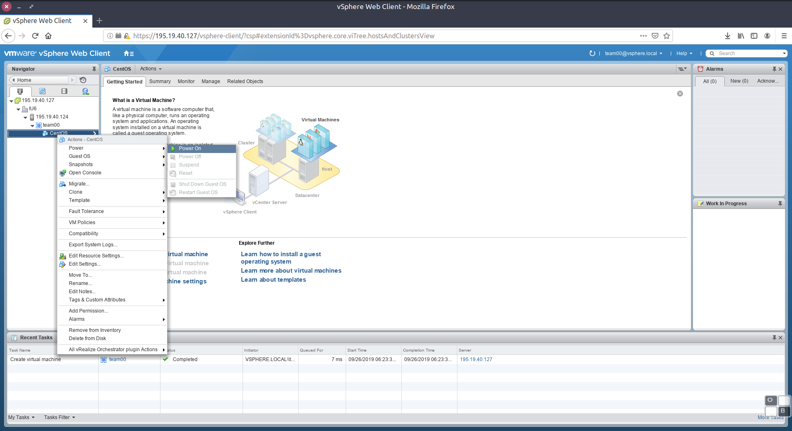

Откройте консоль ВМ:

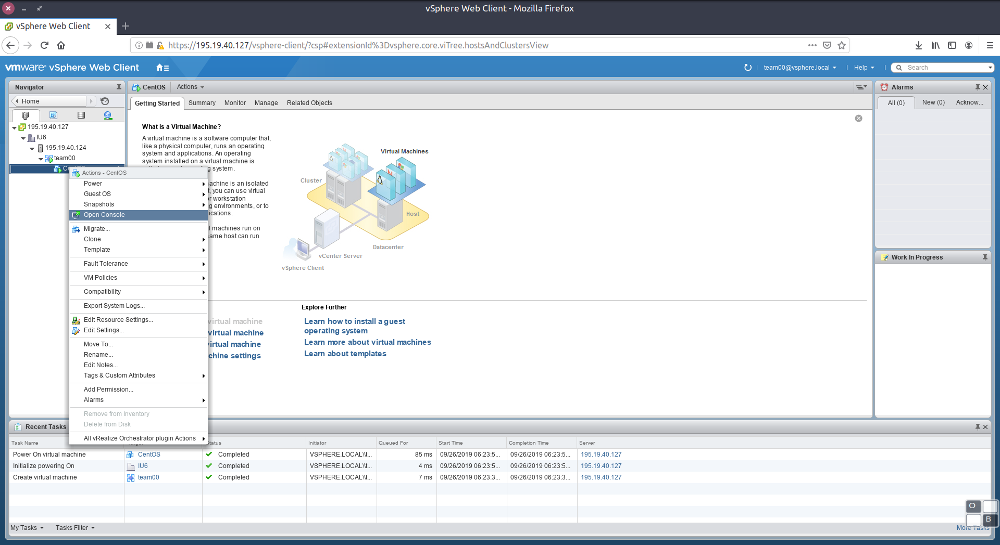

Установите ОС со следующими сетевыми настройками:

На сетевом интерфейсе ens160:

    Параметры сети: 195.19.36.64/27
    IP адрес: выдается организаторами из диапазона 195.19.36.64/27
    Шлюз: 195.19.36.65
    DNS: 195.19.32.2

На сетевом интерфейсе ens192:

    Параметры сети: 192.168.1.0/24
    IP адрес: 192.168.1.1

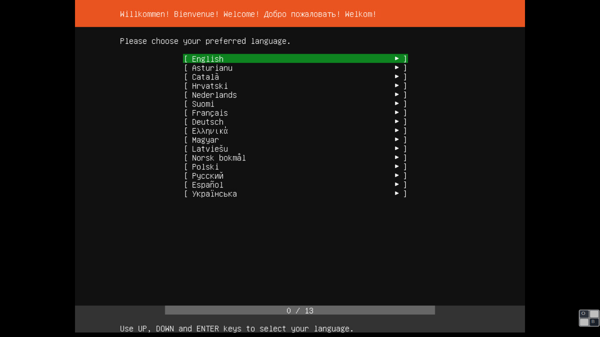

При установке серверной версии ОС Ubuntu обязательно разрешите использование LVM (Logical Volume Manager), что позволит расширять объем логических томов в процессе работы Linux.

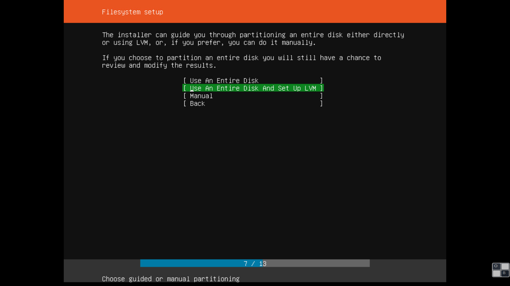

Разрешите установку и запуск OpenSSH сервера, что понадобится для соединения с Вашей виртуальной системой по протоколу SSH.

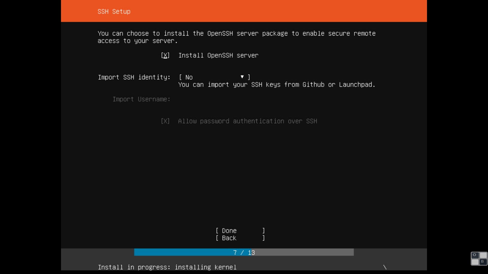

После установки системы перегрузите виртуальную машину и выполните вход по введенным вами реквизитам пользователя.

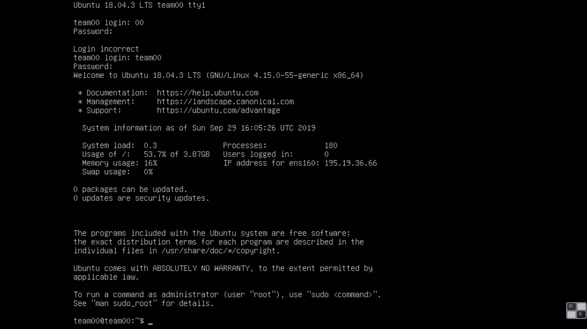

Проверьте, что сетевое соединение работает:

    ping www.ya.ru

Если соединение отсутствует, его необходимо установить. Использовать следует способы и ПО, поставляемое с выбранной вами ОС.

В случае использования серверной версии Ubuntu, отредактируйте файл /etc/netplan/50-cloud-init.yaml. После этого актуализируйте конфигурацию сети по команде:

    sudo netplan apply

Внимание! В других версиях ОС Linux, отличных от Ubuntu 18.04.3 может потребоваться изменение файла /etc/network/interfaces или использование другого механизма настройки сети (см. мануалы к версии вашей ОС).

Используя терминал операционной системы можно выполнить пинг вашей системы:

    ping 195.19.36.**
    PING 195.19.36.** (195.19.36.**) 56(84) bytes of data.
    64 bytes from 195.19.36.**: icmp_seq=1 ttl=58 time=5.94 ms
    64 bytes from 195.19.36.**: icmp_seq=2 ttl=58 time=5.79 ms

Если успешно установлено соединение с вашей ВМ, то можно подключиться к ней используя терминал с поддержкой протокола SSH (Tilix, Putty, term и пр.).
В ОС Linux это можно сделать по команде:

    ssh username@ip_address

где ip_address - ip адрес вашей ВМ.

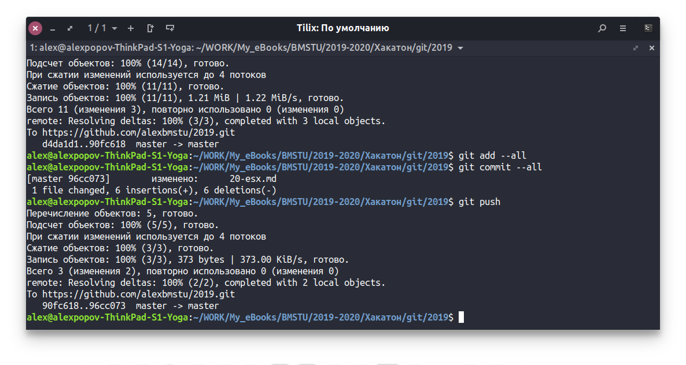

****
## Создание виртуальной машины в локальной сети и настройка шлюза

Если в проекте понадобится использовать несколько серверов (например, сервер видеоаналитики) и обеспечить к ним доступ по единственному выделенному ip адресу, потребуется использовать локальную сеть (сеть team** с диапазоном адресов 192.168.1.0/24). Доступ ко всем локальным серверам будет осуществляться через шлюз, в котором необходимо выполнить конфигурирование доступа.

Создадим новую виртуальную машину в вашем пуле ресурсов со следующими параметрами:

В диалоге выбора ресурсов виртуальной машины выберите следующие ресурсы:

- 2 CPU

- 4 GB RAM

- 20 GB HDD. 

- Одна сетевая карта типа `VMXNET 3`, подключенная к сети `team**`.
 

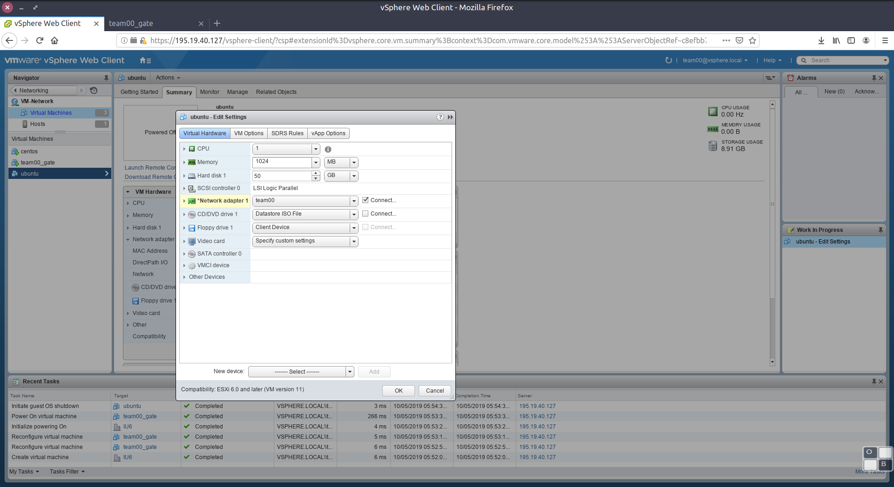

Далее повторите установку операционной системы аналогично предыдущей. 

Настройте сетевой интерфейс следующим образом:

    Параметры сети: 192.168.1.0/24
    IP адрес: 192.168.1.2/24
    Шлюз: 192.168.1.1
    DNS: 195.19.32.2

После установки проверьте доступность шлюза по команде:

    ping 192.168.1.1

При необходимости отредактируйте файл /etc/netplan/50-cloud-init.yaml и выполните команду:

    sudo netplan apply

Далее настроим шлюз (виртуальную машину с внешним ip адресом `195.19.36.**`) таким образом, чтобы соединение с портом 2022 на интерфейсе ens160 перенаправлялось через интерфейс ens192 на порт 22 по сетевому адресу 192.168.1.2.

Войдите через ssh консоль на шлюз:

    ssh username@ip_address

Далее получите права root:

    sudo -i

Введите следующие команды (замените `**` на ваш ip адрес):

    iptables -t nat -A POSTROUTING -s 192.168.1.2 -o ens160 -j MASQUERADE
    iptables -t nat -A PREROUTING -p tcp -d 195.19.36.** --dport 2022 -j DNAT --to-destination 192.168.1.2:22
    iptables -t filter -A FORWARD -i ens192 -d 192.168.1.2 -p tcp --dport 2022 -j ACCEPT

Сохраним конфигурацию  iptables в файл:

    iptables-save > /etc/iptable.restore

Удостоверьтесь, что в системе разрешен форвардинг:

    cat /proc/sys/net/ipv4/ip_forward
    1

Если форвардинг запрещен (ответ:`0`), разрешите его в файле /etc/sysctl.conf. Необходимо раскомментировать строку:

    net.ipv4.ip_forward = 1

Далее применим изменения:

    sysctl -p 

Далее разрешим настройку iptables из файла /etc/iptable.restore при старте системы. Для этого создадим сервис:

    nano /etc/systemd/system/restore-iptables-rules.service

Скопируйте в файл следующие строки:

    [Unit]
    Description = Apply iptables rules

    [Service]
    Type=oneshot
    ExecStart=/bin/sh -c 'iptables-restore < /etc/iptable.restore'

    [Install]
    WantedBy=network-pre.target

Далее разрешим сервис командой:

    systemctl enable restore-iptables-rules.service

Далее выполним `reboot` и проверим, что iptables настроены правильно: 

    sudo iptables -L

 
Проверьте, что форвардинг портов работает и из внешней сети (подключитесь с вашего рабочего компьютера или с компьютера на кафедре):

    ssh username@ip_address -p 2022
 

****
## Уcтановка фреймворка Anaconda и Jupyter Notebooks 

Anaconda Distribution это фреймворк с открытым исходным кодом, который объединяет библиотеки и средства разработки кода на языках Python / R для решения задач в области машинного обучения и науки о данных. Anaconda доступна как в виде десктопного приложения на платформах Linux, Windows и Mac OS X, так и в составе серверного ПО. В состав дистрибутива входит более 1500 пакетов Python / R для научных исследований, средста управления бибилиотеками Conda, средства разработки  обучения моделей машинного обучения и глубокого обучения scikit-learn, TensorFlow и Theano, известные бибилотеки для анализа данных (Dask, NumPy, pandas и Numba и т.д.) и визуализации результатов (Matplotlib, Bokeh, Datashader, Holoviews и пр.)

Подключимся к виртуальной машине:

    ssh username@ip_address -p 2022

Подготовим виртуальную машину, созданную нами в локальной сети, к установке дистрибутива. Необходимо по крайней мере 2 ГБ свободного места на жестком диске в томе **/**. Проверим это: 

    df -h
    Filesystem                         Size  Used Avail Use% Mounted on
    udev                               463M     0  463M   0% /dev
    tmpfs                               99M  1.1M   98M   2% /run
    /dev/mapper/ubuntu--vg-ubuntu--lv  3.9G  3.7G     0 100% /
    tmpfs                              493M     0  493M   0% /dev/shm
    tmpfs                              5.0M     0  5.0M   0% /run/lock
    tmpfs                              493M     0  493M   0% /sys/fs/cgroup
    /dev/loop0                          89M   89M     0 100% /snap/core/7270
    /dev/sda2                          976M   76M  834M   9% /boot
    tmpfs                               99M     0   99M   0% /run/user/1000

Место, выделенное на диске во время установки системы явно недостаточно. Если на вашей виртуальной машине достаточно места, пропустите следющие шаги, перейдите [сюда](#230).

Так как мы использовали `LVM`, нам необходимо расширить логический том за счет имеющегося свободного пространства на диске. Выведем список логических томов:

    sudo lvdisplay

    --- Logical volume ---
    LV Path                /dev/ubuntu-vg/ubuntu-lv
    LV Name                ubuntu-lv
    VG Name                ubuntu-vg
    LV UUID                nZSozr-hX7F-foyY-op40-8uKp-IYL9-wLplX0
    LV Write Access        read/write
    LV Creation host, time ubuntu-server, 2019-09-29 15:54:06 +0000
    LV Status              available
    # open                 1
    LV Size                4.00 GiB
    Current LE             1024
    Segments               1
    Allocation             inherit
    Read ahead sectors     auto
    - currently set to     256
    Block device           253:0

В отчете указано, что логический том размещен в группе физических томов **ubuntu-vg**, где мы и будем выделять пространство. Уточним, есть ли свободное место в **ubuntu-vg**:

    sudo vgdisplay

    --- Volume group ---
    VG Name               ubuntu-vg
    System ID             
    Format                lvm2
    Metadata Areas        1
    Metadata Sequence No  3
    VG Access             read/write
    VG Status             resizable
    MAX LV                0
    Cur LV                1
    Open LV               1
    Max PV                0
    Cur PV                1
    Act PV                1
    VG Size               <49.00 GiB
    PE Size               4.00 MiB
    Total PE              12543
    Alloc PE / Size       1024 / 3.70 GiB
    Free  PE / Size       11519 / 46.30 GiB
    VG UUID               dvjRPM-MLcl-QsFw-sXPp-72CA-mZpy-Oeb3fy

Также можно узнать, на каком из физических дисков емеется свободное пространство (т.к. у нас только один диск, показан будет он)

    sudo pvdisplay

    --- Physical volume ---
    PV Name               /dev/sda3
    VG Name               ubuntu-vg
    PV Size               <49.00 GiB / not usable 0   
    Allocatable           yes 
    PE Size               4.00 MiB
    Total PE              12543
    Free PE               1024
    Allocated PE          11519
    PV UUID               Z1Ya4U-czwy-37JR-DAYw-SDTm-v9JI-oP3zCT

В отчете lvdisplay указан системный путь к логическому устройству тома: **/dev/ubuntu-vg/ubuntu-lv**. Расширим его на 2048 блоков по 4 MiB: 

    sudo lvextend -l +2048 /dev/ubuntu-vg/ubuntu-lv

    sudo resize2fs /dev/ubuntu-vg/ubuntu-lv 

    sudo lvdisplay

    --- Logical volume ---
    LV Path                /dev/ubuntu-vg/ubuntu-lv
    LV Name                ubuntu-lv
    VG Name                ubuntu-vg
    LV UUID                nZSozr-hX7F-foyY-op40-8uKp-IYL9-wLplX0
    LV Write Access        read/write
    LV Creation host, time ubuntu-server, 2019-09-29 15:54:06 +0000
    LV Status              available
    # open                 1
    LV Size                12.00 GiB
    Current LE             3072
    Segments               1
    Allocation             inherit
    Read ahead sectors     auto
    - currently set to     256
    Block device           253:0

Далее уточним состояние логического тома:

    df -h

    Filesystem                         Size  Used Avail Use% Mounted on
    udev                               463M     0  463M   0% /dev
    tmpfs                               99M  1.1M   98M   2% /run
    /dev/mapper/ubuntu--vg-ubuntu--lv   12G  3.7G    8G  30% /
    tmpfs                              493M     0  493M   0% /dev/shm
    tmpfs                              5.0M     0  5.0M   0% /run/lock
    tmpfs                              493M     0  493M   0% /sys/fs/cgroup
    /dev/loop0                          89M   89M     0 100% /snap/core/7270
    /dev/sda2                          976M   76M  834M   9% /boot
    tmpfs                               99M     0   99M   0% /run/user/1000

Теперь места на диске достаточно, начнем установку Anaconda. Установим дистрибутив в домашней директории пользователя виртуальной машины:

    cd ~
    wget https://repo.anaconda.com/archive/Anaconda3-2019.03-Linux-x86_64.sh
    chmod +x Anaconda3-2019.03-Linux-x86_64.sh
    bash ./Anaconda3-2019.03-Linux-x86_64.sh

Проверим список установленных пакетов:

    conda list

Обновим устаревшие пакеты:

    conda update conda

Теперь необходимо настроить Jupyter Notebook. Сгенерируем шаблон конфигурационного файла:

    jupyter notebook --generate-config

Теперь добавим в конфигурационный файл, указанный при создании (`~/.jupyter/jupyter_notebook_config.py`) следующие строки:

    # Разрешим доступ из внешней сети
    c.NotebookApp.ip = '192.168.1.2'
    c.NotebookApp.open_browser = False
    # Укажем порт, на котором будет работать Jupyter Notebook
    c.NotebookApp.port = 8888

Далее создадим файл с хешированным паролем:

    jupyter notebook password

Теперь все готово для запуска Jupyter Notebook. Вы можете сделать это в консоли по команде:

    jupyter notebook &
    # или
    jupyter lab &
    # если вы не хотите читать лог приложения в консоли, вы можете перенаправить поток сообщений на устройство /dev/null:
    jupyter notebook &>/dev/null &

Далее необходимо разрешить фовардинг порта 8888 на шлюзе `195.19.36.**`. Подключимся к виртуальной машине шлюза (не перепутайте!!!):

    ssh username@ip_address

Далее:

    sudo -i
    iptables -t nat -A PREROUTING -p tcp -d 195.19.36.** --dport 8888 -j DNAT --to-destination 192.168.1.2:8888
    iptables -t filter -A FORWARD -i ens192 -d 192.168.1.2 -p tcp --dport 8888 -j ACCEPT

Сохраним конфигурацию  iptables в файл:

    iptables-save > /etc/iptable.restore

Теперь вы можете подключиться к Jupyter Notebook в броузере с вашего десктопа по адресу:

    http://<ip адрес вашего сервера>:8888/

Помните, что порт 8888 должен быть открыт в firewall вашей ОС

