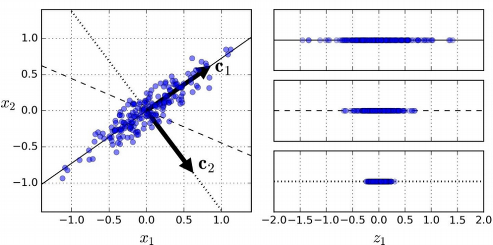
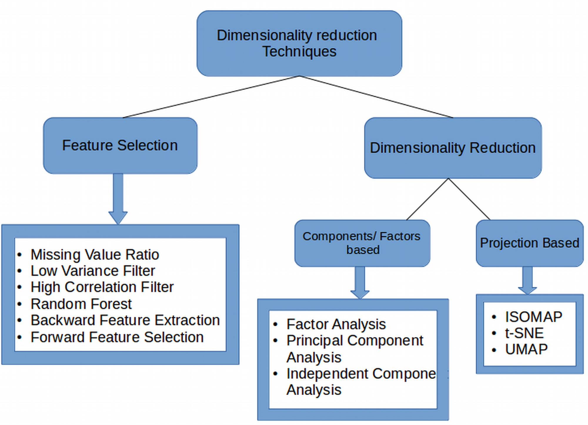

****
# День 2. Практикум в Jupyter Notebook <a name="3"></a>

## Методология машинного обучения <a name="3_1"></a>

Существует мнение о том, что не существует единого метода машинного обучения, который лучше всего справлялся бы со всеми проблемами. Независимо от того, насколько сложен или прост применяемый метод или алгоритм, он не будет работать наилучшим образом для всех проблем. Поэтому, чтобы найти наилучший метод и его алгоритмическую реализацию, которые соответствовали бы потребностям конкретной задачи, необходимо обладать широким кругозором методов и алгоритмов, а также владеть техническими средствами анализа данных.

В нашем конкурсе будем придерживаться следующей упрощенной методологии машинного обучения:

    - Прежде чем углубляться в сложные методы и тратить время на тонкую настройку модели, лучше попробовать более простые методы и алгоритмы. По мере продвижения к более сложным методам мы можем обнаружить, что для  наших нужд оказывается достаточно уже примененнного и более простого подхода.

    - Гибкая методология машинного обучения предполагают, что мы должны развивать понимание данных итерационно. Это означает, что мы не должны пытаться разрешить все проблемы сразу. Для науки о данных это означает, что мы начинаем с простого подхода и готовимся к применению более сложных методов, методик, алгоритмов, моделей и т.д и т.п.. 

    - Первая итерация должна иметь наиболее простой вариант реализации каждого этапа конвейера машинного обучения(например, обработка, извлечение признаков и пр.). Дополнительным достоинством такого подхода является то, что применение упрощенных подходов менее затратно с точки зрения вычислительной мощьности, не требует интенсивных вычислений или дорогих поисков гиперпараметров. Бесспорно, простая модель может работать плохо, но получение этой модели возможно максимально быстро и с минимальными затратами ресурсов. 

    - Для интерпретации полученных результатов и уточнения применяемых методов необходимо привлечение специалистов по предметной области, которые могут интерпретировать полученный результат. 

Пример такого простого метода: поиск ближайшего соседа и другие подобные методы. Для их реализации требуется лишь несколько строк кода. Вместе с тем нет никаких причин, по которым более простые методы не могут быть лучше сложных. На последующих итерациях конверйера машинного обучения исследуются другие подходы. Это позволит нам сравнить, как методологические изменения влияют на производительность, и отслеживать улучшения с течением времени. Тем не менее, по мере дальнейших исследований улучшение качества модели становится все более проблематичным. Например, если мы достигли точности 99%, возможно, нам не следует тратить больше времени и ресурсов, чтобы пробовать доводить ее до 99,2%. 


[Словарь терминов машинного обучения](https://docs.microsoft.com/ru-ru/dotnet/machine-learning/resources/glossary)

Далее подробнее рассмотрим этапы конвейера машинного обучения.


## Предварительная обработка данных <a name="3_2"></a>


Целью предварительной обработки является преобразование необработанных данных в форму, которая подходит для машинного обучения. Структурированные и чистые данные позволяют получать более точные результаты из прикладной модели. Этап предполагает форматирование данных, очистку и выборку достоверных значений. Этот этап может также включать в себя сокращение числа несвязанных признаков с помощью композиции признаков, если к исследованиям подключены специалисты, которые могут это сделать (для этого требуются расширенные знания предметной области). Привлечение специалистов в преметной области является важнейшим фактором успеха применения машинного обучения. 


### Очистка данных <a name="3_2_1"></a>

*Очистка данных*, это набор процедур, которые позволяют удалить шум и устранить несоответствия в данных. Этот процесс включает в себя заполнение недостающих данных с использованием метдов подстановки правдоподобных значений (таких, как замена отсутствующих значений на средние или максимальные значения и т.д.). Обнаружение выбросов (наблюдений, которые значительно отличаются от остальной части распределения) также важно для понимания данных. Анализ таких данных и принятие решения об очистке должен приниматься совместно со специалистом по предметной области.  Если какие-либо выбросы указывают на ошибочные данные, их следует удалить или исправить, если это возможно. Этот этап также включает в себя удаление неполных и бесполезных записей данных и столбцов.

### Масштабирование <a name="3_2_2"></a>

*Масштабирование* – данные могут иметь числовые атрибуты (признаки), которые охватывают сильно отличающиеся диапазоны, например, миллиметры, метры и километры. Масштабирование - это преобразование таких атрибутов таким образом, чтобы они имели одинаковый масштаб, например, в диапазоне от 0 до 1 или от 1 до 10 для наименьшего и наибольшего значения для атрибута. 

*Минимаксная* нормализация представляет собой линейное отображение данных из одного интервала в другой. Данный подход предполагает вычитание минимального значения объекта из остальных значений, после чего значения делятся на полученный диапазон. Он сохраняет исходное распределение функции и не вносит существенных изменений в информацию, встроенную в исходные данные. 

*Нормализация стандартным отклонением* модифицирует признаки путем вычитания среднего значения, а затем деления на стандартное отклонение. Это изменяет распределение признаков и приводит к распределению со средним значением, равным нулю, и стандартным отклонением, равным единице. 

*Логарифмическое преобразование* важно для преобразования мультипликативных отношений между признаками в аддитивные отношения. Так как большие значения уменьшаются больше, чем маленькие, логарифмическое преобразование имеет эффект псевдоскейлинга, поскольку различия между большими и малыми значениями в наборе данных уменьшаются. 

Выбор одного метода масштабирования среди других зависит не только от набора данных, но и от выбранного метода машинного обучения, поскольку различные методы машинного обучения фокусируются на разных аспектах данных. Например, метод кластеризации фокусируется на анализе сходства точек данных, в то время как анализ главных компонентов (PCA) выявляет наиболее существенные признаки данных. Использование наиболее адекватного метода масштабирования может улучшить результаты кластеризации.

**Дополнительные источники литературы по данному разделу:**

- [Практическое руководство по подготовке данных (en)](https://www.analyticsvidhya.com/blog/2016/07/practical-guide-data-preprocessing-python-scikit-learn/)

- [Масштабирование данных данных (en)](https://codefellows.github.io/sea-python-401d5/lectures/rescaling_data.html#)


### Уменьшение размерности<a name="3_2_3"></a>

*Уменьшение размерности* (Dimesion Reduction) – основная проблема при интерпретации многомерных данных заключается в том, что соответствующие истинные закономерности скрыты нерелевантными данными или шумом. Для малых и средних наборов данных можно использовать классические статистические методы, которые фокусируются на идентификации сильных статистических закономеростей. Такие методы, однако, не могут быть распространены на случаи, когда размерность данных намного превышает размер записей, а слабые истинные сигналы окружены значительным количеством шума (например, как в случае современного геномного анализа). Кроме того, диапазон шума имеет тенденцию увеличиваться с увеличением размерности данных, что часто делает существующие методы непрактичными [3]. По мере роста количества признаков или измерений, объем данных, которые нам необходимы для точного обобщения, растет в геометрической прогрессии.

При добавлении нового признака в модель иногда не хватает данных для поддержания отношений, и, следовательно, новый признак может не иметь положительное влияние на модель. Например, в нашем исследовании мы имеем 299 переменных (p = 299). В этом случае мы можем иметь 299 (299-1) / 2 = 44551 различных парных групп признаков. Нет смысла визуализировать каждый из них в отдельности. В тех случаях, когда у нас большое количество переменных, лучше выбрать подмножество этих переменных (p << 100), которое собирает столько информации, сколько и исходный набор переменных. Вот некоторые преимущества применения уменьшения размерности к набору данных:

• пространство, необходимое для хранения данных, уменьшается по мере уменьшения количества измерений;

• уменьшение размеров приводит к меньшему времени вычислений / обучения;

• некоторые алгоритмы плохо обрабатывают большие размеры данных. Таким образом, чтобы эти алгоритмы были полезны, необходимо уменьшить размерность задачи;

• уменьшение размерности способствует т.н. мультиколлинеарности (наличии линейной зависимости между объясняющими переменными), удаляя лишние признаки. Например, у вас есть две переменные - «время, проведенное на беговой дорожке в минутах» и «потраченные калории». Эти переменные сильно коррелируют: чем больше времени вы проводите на беговой дорожке, тем больше калорий вы будете сжигать. Следовательно, нет смысла хранить оба, так как достаточно одного из них для создания адекватной модели.

• это помогает в визуализации данных. Как обсуждалось ранее, очень трудно визуализировать данные для многих измерений. Поэтому сокращение пространства до 2D или 3D может позволить нам более четко отображать и наблюдать кластеры данных.

Уменьшение размерности может быть сделано двумя различными способами:

• выбором признаков: сохраняются только самые важные переменные из исходного набора данных,

• путем нахождения меньшего набора новых переменных, каждая из которых является комбинацией входных переменных, содержащих в основном ту же информацию, что и входные переменные.


**Дополнительные источники литературы по данному разделу:**

- [Практическое руководство по подготовке данных (en)](https://www.analyticsvidhya.com/blog/2016/07/practical-guide-data-preprocessing-python-scikit-learn/)

- [Масштабирование данных данных (en)](https://codefellows.github.io/sea-python-401d5/lectures/rescaling_data.html#)


### Алгоритм отбора признаков<a name="3_2_4"></a>

*Алгоритм отбора признаков* – один из наиболее широко используемых алгоритмов выбора объектов для построения модели данных. Этот алгоритм помогает выбрать меньшее подмножество признаков по сравнению с первоначальным. Алгоритм отбора признаков можно рассматривать как комбинацию техник поиска для представления нового поднабора признаков вместе с вычислением меры, которая отражает различие подмножеств признаков. 

    Wiki цитата: В традиционной статистике наиболее популярной формой отбора признаков является ступенчатая регрессия, которая является техникой оборачивания. Это жадный алгоритм, который добавляет лучший признак (или удаляет худший) на каждом шаге алгоритма. Главная проблема — когда остановить алгоритм. При обучении машин это обычно делается путём перекрёстной проверки. В статистике некоторые критерии оптимизированы. Это ведёт к наследованию проблемы вложения. Исследовались и более устойчивые методы, такие как метод ветвей и границ и кусочно-линейная сеть.

**Дополнительные источники литературы по данному разделу:**

- [Алгоритмы отбора признаков (ру)](https://ru.wikipedia.org/wiki/%D0%9E%D1%82%D0%B1%D0%BE%D1%80_%D0%BF%D1%80%D0%B8%D0%B7%D0%BD%D0%B0%D0%BA%D0%BE%D0%B2)

### Обратное удаление признаков<a name="3_2_5"></a>

*Обратное удаление признаков* (Backward Feature Elimination) - рекурсивно удаляет некоторые отобранные признаки, строит модель с использованием оставшихся признаков и вычисляет точность модели. Он включает в себя следующие этапы:

1) сначала берутся все «n» переменных, присутствующих в наборе данных, и на них обучатся модель;

2) далее рассчитывается точность модели,

3) затем вычисляется точность модели после исключения каждой из переменной (всего получается n упрощенных моделей), то есть каждый раз отбрасывается одна переменная и модель строится на оставшихся «n-1» переменных;

4) определяется переменная, удаление которой дало наименьшее изменение точности модели, а затем эта переменная отбрасывается;

5) весь процесс повторяется пока какая-либо переменная может быть отброшена.

Для работы алгоритма нужно указать алгоритм и количество объектов, которые нужно выбрать. С помощью данного алгоритма также может быть выполнено ранжирование переменных.


### Выбор вперед<a name="3_2_6"></a>

*Выбор вперед* (Forward Feature Elimination) - это противоположный *обратному удалению признаков* процесс. Вместо того, чтобы исключать признаки и удалять их, мы пытаемся найти лучшие признаки для представления более точной модели. Эта техника работает следующим образом:

1) мы начинаем с одного признака. По сути, мы обучаем модель «n» раз, используя каждый признак отдельно;

2) переменная, дающая наилучшую точность обученной модели выбирается в качестве начальной переменной;

3) затем мы повторяем этот процесс и добавляем одну переменную за каждый проход алгоритма;

4) переменная, которая дает наибольшее увеличение производительности, фиксируется в модели;

5) мы повторяем этот процесс до тех пор, пока не будут замечены значительные улучшения в производительности модели.

    ПРИМЕЧАНИЕ. Как обратное удаление, так и прямой выбор функций требуют много времени и вычислительных затрат.

**Дополнительные источники литературы по данному разделу:**

- [Forward Feature Elimination Wiki](https://en.wikipedia.org/wiki/Feature_selection)

### Анализ главных компонентов<a name="3_2_7"></a>

*Анализ главных компонентов* (Principal Component Analysis) PCA, это методика, которая помогает нам извлекать новый набор переменных из существующего большого набора переменных. Эти вновь извлеченные переменные и называются главными компонентами. 

Вот некоторые из ключевых моментов, которые следует знать о PCA:

1) главные компоненты представляет собой линейную комбинацию исходных переменных;

2) основные компоненты выбираются таким образом, что первый основной компонент обеспечивал максимальную дисперсию в наборе данных;

3) второй основной компонент пытается объяснить оставшуюся дисперсию в наборе данных и не связан с первым главным компонентом,

4) каждое дополнительное измерение, которое мы добавляем в методике PCA, отражает все меньше и меньше дисперсии в модели. Первый компонент является наиболее важным, затем следует второй, затем третий и т. д.

5) чтобы найти каждый компонент, алгоритм пытается максимизировать дисперсию, и каждый новый компонент должен быть ортогональным к другим.


**Анализ главных компонентов**

Слева мы имеем представление простого двумерного набора данных с тремя одномерными гиперплоскостями. С другой стороны, справа показан результат проецирования набора данных на каждую из этих одномерных гиперплоскостей. Cтановится ясно, что гиперплоскость, представленная сплошной линией, выявляет максимальную дисперсию в наборе данных. Она также позволяет найти вторую ось (пунктирную линию), ортогональную первой, которая учитывает наибольшее количество оставшихся отклонений данных.

Если бы мы имели дело с большим количеством измерений (как это и есть в реальных задачах), PCA нашел бы большее количество ортогональных осей к предыдущим осям (фактически столько осей, каково число измерений в наборе данных). Единичный вектор, который определяет i-ю ось, называется главным компонентом (PC). В этом случае первый PC - это С1, а второй PC - С2. После того, как мы определили наши основные компоненты, пришло время уменьшить размерность набора данных до d измерений, проецируя его на гиперплоскость, определенную первыми d основными компонентами. Обычно, в практических задачах, большое количество измерений, это то, что составляет достаточно большую часть дисперсии (~ 90%).

**Дополнительные источники литературы по данному разделу:**

- [Метод главных компонент (Wiki)](https://ru.wikipedia.org/wiki/%D0%9C%D0%B5%D1%82%D0%BE%D0%B4_%D0%B3%D0%BB%D0%B0%D0%B2%D0%BD%D1%8B%D1%85_%D0%BA%D0%BE%D0%BC%D0%BF%D0%BE%D0%BD%D0%B5%D0%BD%D1%82)


### Независимый компонентный анализ<a name="3_2_8"></a>


*Независимый компонентный анализ* (Independent Component Analysis, ICA) - основан на теории информации, а также является одним из наиболее широко используемых методов уменьшения размерности. Основное различие между PCA и ICA состоит в том, что PCA ищет некоррелированные факторы, в то время как ICA ищет независимые факторы. Если две переменные некоррелированы, это означает, что между ними нет линейной зависимости. Если они независимы, это означает, что они не зависят от других переменных. Например, возраст человека не зависит от того, что он ест, или от того, сколько он смотрит телевизор.

Этот алгоритм предполагает, что данные переменные представляют собой линейные смеси некоторых неизвестных скрытых переменных. Также предполагается, что эти скрытые переменные являются взаимно независимыми, то есть они не зависят от других переменных и, следовательно, их называют независимыми компонентами наблюдаемых данных.

**Дополнительные источники литературы по данному разделу:**

- [Анализ независимых компонент Wiki](https://ru.wikipedia.org/wiki/%D0%90%D0%BD%D0%B0%D0%BB%D0%B8%D0%B7_%D0%BD%D0%B5%D0%B7%D0%B0%D0%B2%D0%B8%D1%81%D0%B8%D0%BC%D1%8B%D1%85_%D0%BA%D0%BE%D0%BC%D0%BF%D0%BE%D0%BD%D0%B5%D0%BD%D1%82)


### Факторный анализ<a name="3_2_9"></a>


*Факторный анализ* (Factor Analysis) –  предположим, у нас есть две переменные: доход и образование. Эти переменные потенциально могут иметь высокую корреляцию, поскольку люди с более высоким уровнем образования, как правило, имеют значительно более высокий доход, и наоборот. В методе факторного анализа переменные сгруппированы по их корреляциям, то есть все переменные в определенной группе будут иметь высокую корреляцию между собой, но низкую корреляцию с переменными другой группы (групп). Здесь каждая группа известна как фактор. Эти факторы невелики по сравнению с исходными размерами данных. Однако эти факторы трудно наблюдать.

**Дополнительные источники литературы по данному разделу:**

- [Факторный анализ](https://ru.wikipedia.org/wiki/%D0%A4%D0%B0%D0%BA%D1%82%D0%BE%D1%80%D0%BD%D1%8B%D0%B9_%D0%B0%D0%BD%D0%B0%D0%BB%D0%B8%D0%B7)

- [Просто о факторном анализе](https://habr.com/ru/post/224495/)


### Многообразное обучение или нелинейное уменьшение размерности<a name="3_2_10"></a>


*Многообразное обучение или нелинейное уменьшение размерности* (Manifold Learning) –  это нелинейная версия PCA. Проблема состоит в том, что PCA ищет плоские поверхности для описания данных, которые не всегда наилучшим образом показывают макимальную дисперсию. Если плоской поверхности не существует, мы используем Mainfold Learning, чтобы попытаться решить эту проблему более эффективно.
Существует много подходов для решения этой проблемы, таких как Isomap, *Локально линейное вложение*, *Лапласово собственное отображение*, *Полуопределенное вложение* и т.д. Эти алгоритмы работают для извлечения низкоразмерного многообразия, которое можно использовать для описания многомерных данных.


### Локально линейное вложение<a name="3_2_11"></a>

*Локально линейное вложение* (LLE, Locally-Linear Embedding) –  это метод коллективного обучения, который не опирается на проекции в гиперплоскости, подобно PCA. Он работает, изучая, как каждое наблюдение линейно связано с его ближайшими соседями, а затем ищет низкоразмерное представление обучающего набора, где эти отношения лучше всего сохраняются. Для случаев, когда нет большого шума, LLE показывает лучшие результаты по сравнению с PCA. 

**Дополнительные источники литературы по данному разделу:**

- [An Introduction to Locally Linear Embedding](https://cs.nyu.edu/~roweis/lle/papers/lleintro.pdf)

### Cтохастическое вложение соседей с t-распределением<a name="3_2_12"></a>

*Cтохастическое вложение соседей с t-распределением* (t-SNE, t- Distributed Stochastic Neighbor Embedding) –  ищет шаблоны нелинейным способом. t-SNE - это один из немногих алгоритмов, который способен одновременно сохранять как локальную, так и глобальную структуру данных. Он рассчитывает вероятностное сходство точек в многомерном пространстве, а также в низкоразмерном пространстве. Эвклидовы расстояния больших размеров между точками данных преобразуются в условные вероятности, которые представляют сходства.
UMAP –  t-SNE очень хорошо работает с большими наборами данных, но также имеет свои ограничения, такие как потеря крупномасштабной информации, медленное время вычислений и неспособность осмысленно представлять очень большие наборы данных. 

**Дополнительные источники литературы по данному разделу:**

- [t-SNE Вики](https://ru.wikipedia.org/wiki/%D0%A1%D1%82%D0%BE%D1%85%D0%B0%D1%81%D1%82%D0%B8%D1%87%D0%B5%D1%81%D0%BA%D0%BE%D0%B5_%D0%B2%D0%BB%D0%BE%D0%B6%D0%B5%D0%BD%D0%B8%D0%B5_%D1%81%D0%BE%D1%81%D0%B5%D0%B4%D0%B5%D0%B9_%D1%81_t-%D1%80%D0%B0%D1%81%D0%BF%D1%80%D0%B5%D0%B4%D0%B5%D0%BB%D0%B5%D0%BD%D0%B8%D0%B5%D0%BC)

- [Алгоритм t-SNE. Иллюстрированный вводный курс](http://datareview.info/article/algoritm-t-sne-illyustrirovannyiy-vvodnyiy-kurs/)

### Унифицированная аппроксимация и проекция многообразия<a name="3_2_13"></a>

*Унифицированная аппроксимация и проекция многообразия* (UMAP) - это метод сокращения размерности, который может сохранить как большую часть локальной, так и большей глобальной структуры данных по сравнению с t-SNE, с более коротким временем выполнения. 

Некоторые из ключевых преимуществ UMAP:

• он может обрабатывать большие наборы данных и данных большого размера без особых проблем,

• он сочетает в себе возможности визуализации с возможностью уменьшения размеров данных,

• наряду с сохранением локальной структуры, он также сохраняет глобальную структуру данных. UMAP отображает близкие точки на многообразии в соседние точки в низкоразмерном представлении и делает то же самое для удаленных точек,

• этот метод использует концепцию k-ближайшего соседа и оптимизирует результаты с использованием стохастического градиентного спуска. Сначала он вычисляет расстояние между точками в многомерном пространстве, проецирует их на низкоразмерное пространство и вычисляет расстояние между точками в этом низкоразмерном пространстве. Затем он использует Stochastic Gradient Descent, чтобы минимизировать разницу между этими расстояниями.

Корреляция между компонентами, полученными из UMAP, значительно меньше по сравнению с корреляцией между компонентами, полученными из t-SNE. Следовательно, UMAP имеет тенденцию давать лучшие результаты.
Краткое описание того, когда использовать каждую методику уменьшения размерности

**Дополнительные источники литературы по данному разделу:**

- [Uniform Approximation and Projection (UMAP) Вики](https://ru.wikipedia.org/wiki/UMAP)


### Краткий обзор алгоритмов и методов уменьшения размерности <a name="3_2_14"></a>
Кратко подведем итоги использования каждого метода уменьшения размерности, который мы рассмотрели. Важно понимать, где использовать определенную технику, поскольку это помогает сэкономить время, усилия и вычислительные мощности.


**Использование методов уменьшения размерности**

#### Соотношение пропущенных значений<a name="3_2_14_1"></a>

Если в наборе данных слишком много пропущенных значений, мы используем этот подход для уменьшения количества переменных. Мы можем отбросить переменные с большим количеством пропущенных значений.

#### Фильтр низкой дисперсии<a name="3_2_14_2"></a>

Мы применяем этот подход для определения и удаления постоянных переменных из набора данных. На целевую переменную не влияют чрезмерно переменные с низкой дисперсией, и, следовательно, эти переменные могут быть безопасно отброшены

#### Фильтр высокой корреляции<a name="3_2_14_3"></a>

Пара переменных, имеющих высокую корреляцию, увеличивает мультиколлинеарность в наборе данных. Таким образом, мы можем использовать эту технику, чтобы найти сильно коррелированные функции и отбросить их соответственно.

#### Случайный лес<a name="3_2_14_4"></a>

Это один из наиболее часто используемых методов, который говорит нам о важности каждого атрибута, присутствующего в наборе данных. Мы можем найти важность каждого атрибута и сохранить самые верхние атрибуты, что приведет к уменьшению размерности. Как методы обратного удаления, так и прямого выбора элементов занимают много вычислительного времени и поэтому обычно используются в небольших наборах данных.

#### Факторный анализ<a name="3_2_14_5"></a>

Этот метод лучше всего подходит для ситуаций, когда у нас есть сильно коррелированный набор переменных. Он делит переменные на основе их соотношения на разные группы и представляет каждую группу с коэффициентом

#### Анализ основных компонентов<a name="3_2_14_6"></a>

Это один из наиболее широко используемых методов работы с линейными данными. Он делит данные на набор компонентов, которые пытаются объяснить как можно больше различий
Независимый анализ компонентов: мы можем использовать ICA для преобразования данных в независимые компоненты, которые описывают данные с использованием меньшего количества компонентов

- ISOMAP: мы используем эту технику, когда данные сильно нелинейны;

- t-SNE: этот метод также хорошо работает, когда данные сильно нелинейны или же требуется более понятная визуализаци данных.

- UMAP: эта методика хорошо работает для многомерных данных. Время его выполнения короче по сравнению с t-SNE.

### Разделение набора данных<a name="3_2_20"></a>

**Разделение набора данных** (Dataset splitting) – набор данных, используемый для машинного обучения, должен быть разделен на три подмножества - наборы обучения, тестирования и проверки.

**Обучающий набор**: используется для обучения модели и определения ее оптимальных параметров - параметров, которые он должен изучить из данных.

**Тестовый набор**: тестовый набор необходим для оценки обученной модели и ее способности к обобщению. Обобщение означает способность модели идентифицировать закономерности в новых невидимых данных после того, как они прошли обучение по данным обучения. Крайне важно использовать различные подмножества для обучения и тестирования, чтобы избежать переобучения модели, что является неспособностью к обобщению, о котором мы упоминали выше.

**Валидационный набор**: цель выделения валидационный набор набора состоит в том, чтобы настроить гиперпараметры модели - структурные параметры более высокого уровня, которые не могут быть непосредственно изучены из данных. Эти параметры могут указывать, например, насколько сложна модель и как быстро она находит шаблоны в данных.

Соотношение обучения и тестового набора обычно составляет 80 процентов. Затем обучающий набор снова разделяется, и его 20 процентов будут использоваться для формирования валидационного набора.
Чем больше используемых данных обучения, тем лучше будет работать потенциальная модель. Следовательно, больше используемых данных тестирования приводит к лучшей производительности модели и возможности обобщения.


## Практическая часть <a name="3_3"></a>

### Работа с данными <a name="3_3_1"></a>

Чтобы работать с данными, необходимо понимать, что они из себя представляют. В начале любого исследования необходимо их загрузить и вывелить некоторые статистики.

Создайте новый Notebook и перенести в папку проекта наборы данных с сайта хакатона:

- [Обучающая выборка данных](data/train_longevity.csv)
- [Тестовая выборка данных](data/test_longevity.csv)

#### Первичный анализ данных <a name="3_3_1_1"></a>


Импортируем библиотеки, нужные нам для работы

```python
 # data analysis and wrangling
import pandas as pd
import numpy as np
import random as rnd

 # visualization
import seaborn as sns
import matplotlib.pyplot as plt
%matplotlib inline 
```

Загрузим данные из исходных файлов:

```python
train_df = pd.read_csv('train_longevity.csv')
test_df = pd.read_csv('test_longevity.csv')
combine = [train_df, test_df]
```

Далее выведем названия столбцов в обучающем датасете:

```python
print(train_df.columns.values)
['Id' 'Longevity' 'Education' 'Sex' 'Age' 'Pet' 'Children' 'Region' 'Activity' 'MedExam' 'Sport']
```

И в тестовом датасете:

```
print(test_df.columns.values)
['Id' 'Education' 'Sex' 'Age' 'Activity' 'Sport' 'IsAlone' 'Age*Education']
```

Это даст нам первое представление о наших данных. Далее посмотрим на размеры наших табличных данных. Выполнив построчно код ниже как для 

```python
train_df.shape  	# мы увидим информацию о размерности нашего датафрейма 
train_df.info() 	# покажет информацию о размерности данных 
              	        # описание индекса, количество not-a-number элементов 
train_df.head()         # показывает первые 10 значений датасета
train_df.describe() 	# показывает статистики count,mean, std, min, 25%-50%-75% percentile, max 
train_df.nunique() 	# количество уникальных значений для каждого столбца 
```

Приведем общую терминологию касающауюся наборов данных. Столбцы таблицы датасета это *атрибуты* объекта или его *признаки*. Строки - *объекты*.

**Объект** описывается как набор атрибутов. Объект также известен как запись, случай, пример, строка таблицы и т.д.

**Атрибут** - свойство, характеризующее объект. Атрибут также называют переменной, полем таблицы, измерением, характеристикой.

**Переменная** (variable) - свойство или характеристика, общая для всех изучаемых объектов, проявление которой может изменяться от объекта к объекту.

**Значение** (value) переменной является проявлением признака.

**Генеральная совокупность** (population) - вся совокупность изучаемых объектов, интересующая исследователя.

**Выборка** (sample) - часть генеральной совокупности, определенным способом отобранная с целью исследования и получения выводов о свойствах и характеристиках генеральной совокупности.

**Параметры** - числовые характеристики генеральной совокупности.

**Статистики** - числовые характеристики выборки.

**Гипотеза** - предположение относительно параметров совокупности объектов, которое должно быть проверено на ее части. Гипотеза - частично обоснованная закономерность знаний, служащая либо для связи между различными эмпирическими фактами, либо для объяснения факта или группы фактов.


#### Описание задачи и данных <a name="3_3_1_2"></a>


В нашем хакатоне мы будем использовать задачу анализа факторов активного долголетия. К долголетним будем относить пожилых людей, доживших до 90 лет и сохранивших физическую и социальную активность. Представленные в датасетах данные носят иммитационный характер, однако близки к реальным данным. Данные представляют информацию о пожилых людях в возрасте от 70 до 80 лет, для которых известен класс активного долголетия (зависимый параметр Longevity).

В датасетах приведена следующая информация о пожилых людях (атрибуты объекта):

- Longevity - Класс активного долголетия: 1 - человек доживет до 90 лет; 0 - нет
- Id - Идентификатор пожилого человека;
- Education - Образование: 1 - высшее; 2 - среднее; 3 без образования;
- Sex - Пол;
- Age - Возраст;
- Pet - Пожилой человек ухаживает за домашними животными: указано количество;
- Children - Пожилой человек проживают с детьми/внуками: указано количество проживающих совместно в пожиллым человеком;
- Region - Регион проживания;
- Activity - Уровень физической активности (количество шагов в день): данные получены от специального приложения;
- MedExam - Посещение поликлиники (за послений год): кодирование посещений на основе заполненной медицинской карточки;
- Sport - Физические упражнения: + пожилой человек занимается спортом (ходьба, бег, плаванье); - не занимается


Более детально посмотрим на информацию о количестве каждого уникального значения для каждого столбца в наборе данных:

```python
feature_names = train_df.columns.tolist() 
for column in feature_names: 
    print (column) 
    print (train_df[column].value_counts(dropna=False))
```
Теперь определим количество не-нулевых значений и определенные библиотекой pandos типы атрибутов:

```pytohn
train_df.info()
print('_'*40)
test_df.info()
```

Итак, теперь мы можем судить о том, какие пробемы могут возникнуть с обработкой датасетов:

- Наличие пустых ячеек;
- Нечисловые значения nan (т.н. нечисла в формате Ч.П.З);
- Категориальные данные;
- Недостоверные/ошибочные значения (LINE, ЗНАЧ и другие). 

Начнем последовательно работать с данными, не изменяя исходных файлов csv.

    Плохим тоном в машинном обучении является изменения исходного датасета. Такой подход ведет к безвозвратной потере части значений, возможно, представляющих интерес для последующих итераций исследования. **Правильным считается программное изменение загруженного датасета  с помощью подмены значений, фильтров и т.д.**.


В целом, целью анализа данных является ответ на следующие вопросы:
 
- Какие признаки доступны в наборе данных?
- Какие признаки являются категориальными? Являются ли категориальные значения уникальными наименованиями, порядковыми значениями, отношениями или интервалами? Например, атрибуты Sex, MedExam, Education, Longevity, Id, Region,  являются - категориальными, представленными наименованиями категорий. Education, Longevity, Id, Region являются порядковый категориальный признаками.
- Какие функции являются числовыми? Атрибуты Age, Pet, Children, Activity являются числовыми. - 
- Какие числовые признаки являются непрерывными, какие являются дискретными. Непрерывные: Age, Activity. Дискретность: Pet, Children
- Какие признаки являются смешанными типами данных (числовые, буквенно-цифровые данные внутри одной и той же функции)? Такие атрибуты доблжны быть исправлены. Атрибуты MedExam являются буквенно-цифровыми.
- Какие признаки могут содержать ошибки или опечатки? Функции MedExam, Age, Sport содержат ряд нулевых значений.
- Какие типы данных для различных признаков?
- Каково распределение числовых значений признаков по выборкам? Это помогает нам определить, помимо прочего, насколько репрезентативен обучающий набор данных для фактической проблемной области.


**Анализ данных по сводным таблицам (pivot tables)**

Чтобы подтвердить некоторые из наших наблюдений и предположений, мы можем быстро проанализировать наши корреляции признаков, используя сводные таблицы. На этом этапе мы можем сделать это только для функций, которые не имеют пустых значений. Это также имеет смысл делать только для функций, которые являются категориальными (Sex), порядковыми (Education) или дискретными (Pet, Children).

Пример создания сводной таблицы:

```python
train_df[['Education', 'Longevity']].groupby(['Education'], as_index=False).mean().sort_values(by='Longevity', ascending=False)
```

Проведите аналогичные исследования для групп параметров:

- ("Sex", "Longevity")
- ("Pet", "Longevity")
- ("Children", "Longevity")

**Анализ данных путем визуализации**

Теперь мы можем продолжить подтверждать некоторые из наших предположений, используя визуализации для анализа данных.

Давайте начнем с понимания корреляции между числовыми характеристиками и нашей целью решения (Долгожительство).

Гистограммы полезны для анализа непрерывных числовых переменных, таких как возраст. Гистограмма может указывать распределение выборок с использованием автоматически определенных интервалов или полос одинакового диапазона. Обратите внимание, что ось X в визуализациях неподготовленных данных не позволяет отобразить распрееление.

```python
g = sns.FacetGrid(train_df, col='Longevity')
g.map(plt.hist, 'Age', bins=20)
```

Подготовим данные к визуализации:

```python
#Correct errors in Age column
train_df['Age'].unique()
test_df['Age'].unique()
```

Удалить некорректрное значение можно с помощью вункции map:

```python
idmax = train_df['Age'].value_counts().idxmax()
train_df['Age'] = train_df['Age'].map(lambda v: idmax if v == 'НЕДОСТОВЕРНОЕ ЗНАЧЕНИЕ' else v).astype(float)
test_df['Age'] = train_df['Age'].map(lambda v: idmax if v == 'НЕДОСТОВЕРНОЕ ЗНАЧЕНИЕ' else v).astype(float)
```

Повторите построение гистограммы уже для числовых (float) значений Age: 

Сделайте выводы.

**Корреляция числовых и порядковых признаков**

Мы можем объединить несколько признаков для определения корреляций, используя один график. Это можно сделать с помощью числовых и категориальных функций, которые имеют числовые значения.


```python
grid = sns.FacetGrid(train_df, col='Longevity', row='Education', height=2.2, aspect=1.6)
grid.map(plt.hist, 'Age', alpha=.5, bins=20)
grid.add_legend();
```

Сделайте выводы.


**Корреляция категориальных и числовых признаков**

Нам также понадобится определить корреляцию категориальные характеристики (с нечисловыми значениями) и числовые характеристики. Мы можем рассмотреть корреляцию Sport (категориальное нечисловое значение), Пол (категориальное нечисловое), Активность (числовое непрерывное) с Долгожительством (категориальное числовые)

```python
grid = sns.FacetGrid(train_df, row='Sport', col='Longevity', height=2.2, aspect=1.6)
grid.map(sns.barplot, 'Sex', 'Activity', alpha=.5, ci=None)
grid.add_legend()
```

Сделайте выводы.

#### Задание <a name="3_3_1_3"></a>

1) Признак Age должен быть дополнен и фильтрован для обработки алгоритмами.
2) Признак MedExam может быть отброшен, поскольку является крайне неполным или содержит много нулевых значений как в обучающем, так и в тестовом наборе данных.
3) Необходимо дополнить функцию Sport, поскольку она также может соотноситься с долголетием.
4) Признак Region может быть исключен из нашего анализа, так как содержит большое количество дубликатов (22%) и может отсутствовать корреляция между ним и целевым признаком.
5) Пизнак Id может быть удален из набора обучающих данных, поскольку он не способствует целевому признаку Longevity.
6) Cоздать новый признак под названием  Family (Семья на основе детей и домашних животных), чтобы получить общее количество членов семьи.
7) Cоздать новую функцию для возрастных групп (Age,Education), указывающий на социальный статус пожилого человека. Это превращает непрерывный числовой признак в порядковый категориальный признак.
8) Cоздать функцию диапазона для признака Age, если она помогает нашему анализу (смертность повышается в определенные периоды времени между 70 и 80 годами) для следующих интервалов: { (...,70)[70,72],(72,74],(74,76],(76,78],(80,..)}


**Дополнительные источники литературы по данному разделу:**

- [Введение в pandas: анализ данных на Python](https://khashtamov.com/ru/pandas-introduction/)	


