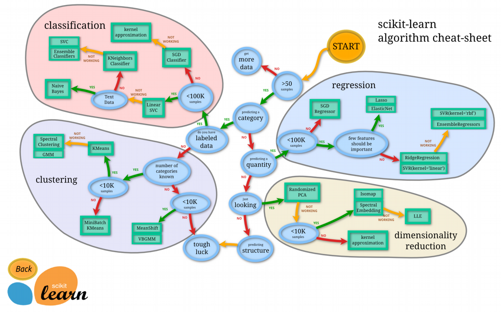
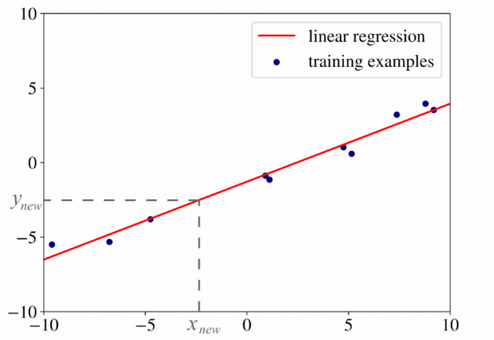
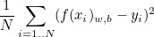
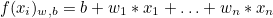
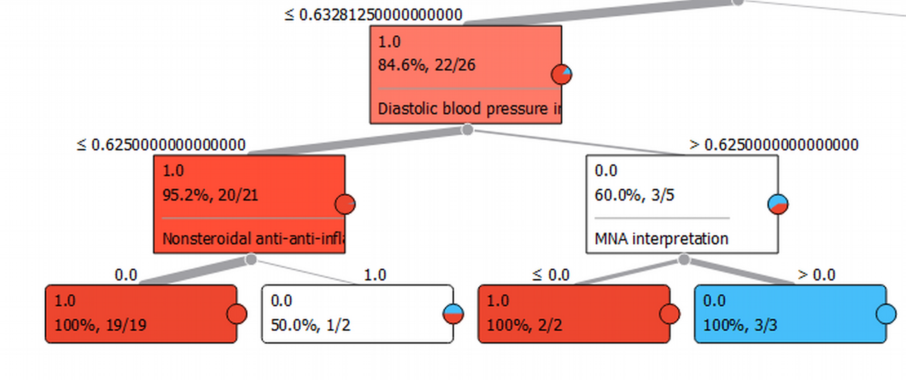
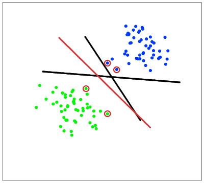
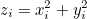
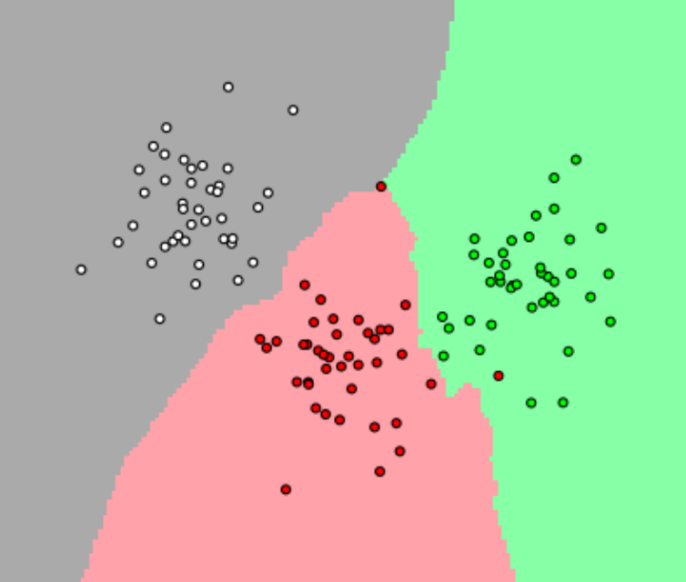
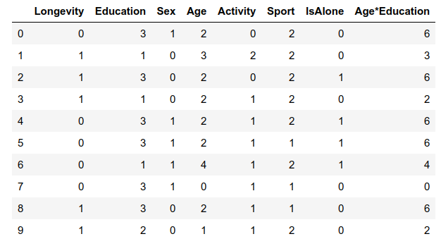
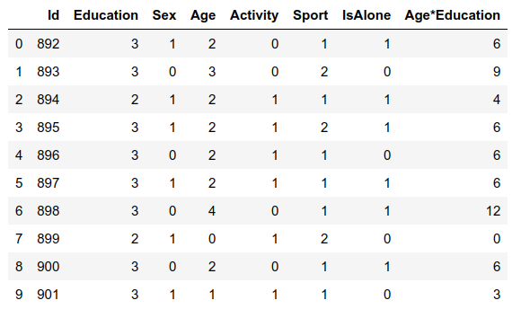

****
# День 3. Алгоритмы машинного обучения <a name="4"></a>


## Алгоритмы машинного обучения <a name="4_3"></a>

После того, как мы предварительно обработали собранные данные и разбили их на три подмножества, мы приступаем к обучению модели. Этот процесс влечет за собой снабжение алгоритма данными обучения. Затем алгоритм обрабатывает данные и выводит модель, которая может найти целевое значение (атрибут) в новых данных (ответ, который мы хотим получить с помощью прогнозного анализа). Целью обучения модели является разработка модели.

Наиболее распространены два модельных стиля обучения - обучение с учителем и обучение без учителя. Выбор каждого стиля зависит от того, должны ли мы прогнозировать конкретные атрибуты или группировать объекты данных по сходству.

• *обучение с учителем*: Контролируемое обучение позволяет обрабатывать данные с целевыми атрибутами или помеченными данными. Обучение с учителем решает проблемы классификации и регрессии.

• *обучение без учителя*: Во время этого стиля обучения алгоритм анализирует немеченые данные. Цель обучения модели - найти скрытые взаимосвязи между объектами данных и объектами структуры по сходствам или различиям. Обучение без учителя направлено на решение таких проблем, как кластеризация, обучение правилам ассоциаций и уменьшение размерности. Например, его можно применять на этапе предварительной обработки данных, чтобы уменьшить сложность данных.

Существует два других стиля обучения модели: *полу-контролируемый*, в котором набор данных содержит как помеченные, так и немаркированные примеры. Второй стиль назвается *обучение с подкреплением*, при котором машина пытается выучить политику действий в соответствии с получением вознаграждения за каждое действие.
Мы опишем алгоритмы, которые являются не только самыми известными, но и либо очень эффективными сами по себе, либо используются в качестве строительных блоков для самых эффективных алгоритмов обучения.



**Алгоритмы машинного обучения**

**Дополнительные источники литературы по данному разделу:**

- [scikit-learn / Machine Learning in Python](https://scikit-learn.org/stable/)

###  Линейная регрессия<a name="4_3_1"></a>

*Линейная регрессия* –  метод поиска зависимости между входными и выходными переменными с линейной функцией связи. Один из способов вычислить значения параметров модели является метод наименьших квадратов (МНК), который минимизирует среднеквадратичную ошибку между реальным значением зависимой переменной и прогнозом, выданным моделью. 

Пусть мы хотим построить модель объясняемой (зависимой) переменной в виде линейной комбинации остальных (независимых) признаков. Цель алгоритма МНК – построить гиперплоскость, максимально приближенную ко всем обучающим примерам.


**Линейная регрессия**

На рисунке показана линия регрессии (красным цветом) для одномерных примеров (синие точки). Мы можем использовать эту прямую, чтобы предсказать значение объясняемой переменной *y(new)* для нового значения независимой переменной *x(new)*.

Чтобы получить эту оптимальную линию (или гиперплоскость в n-мерном случае), процедура оптимизации пытается минимизировать следующее выражение *функции стоимости*:



Выражение под знаком суммы называется *функцией потерь*. Суммировав этy функции для всех значений признака и разделив на количество значений *N* мы получаем среднюю ошибку при выборе конкретной прямой, которая и является функцией стоимости для линейной регрессии. Параметры *w* и *b* для 2-мерной регрессии определяет наклон прямой и ее смещение (в выражении f(x) = w\*x + b). Для большей размерности *w* и *b* представляют собой вектора, определяющие гиперплоскость. В этом случае функция *f* принимает вид:



**Дополнительные источники литературы по данному разделу:**

- [Регрессионный анализ. Кольцов С.Н.](https://www.hse.ru/data/2014/08/29/1313619461/%D0%BB%D0%B5%D0%BA%D1%86%D0%B8%D1%8F%205.pdf)

###  Деревья решений<a name="4_3_2"></a>

*Деревья решений* - это это способ представления правил в иерархической виде, где каждому объекту соответствует единственный узел, пораждающий решение. Структура дерева представляет собой «листья» и «ветки». На рёбрах дерева решения записаны атрибуты, от которых зависит целевая функция, в «листьях» записаны значения целевой функции, а в остальных узлах - атрибуты, по которым различаются случаи.

На основе деревьев решений строятся многие важные алгоритмы классификации данных и регрессии.  Достоинством таких алгоритмов является высокая наглядность представления и простота интерпретации результатов, что может быть очень важным для предметной области: оказывается возможным не только провести процесс классификации, но и объяснить почему тот или иной объект отнесён к какому-либо классу. 

Идея этого алгоритма довольно проста. Дерево строится «сверху вниз» от корня. Начинается процесс с определения, какой атрибут следует выбрать для проверки в корне дерева. Для этого каждый атрибут исследуется на предмет, как хорошо он классифицирует набор данных (разделяет на классы по целевому атрибуту). При этом выбирается тот из атрибутов, который порождает наибольший количественный критерий оценки. Когда атрибут выбран, для каждого его значения создается ветка дерева, набор данных разделяется в соответствии со значением к каждой ветке, процесс повторяется рекурсивно для каждой ветки. Также следует проверять критерий остановки.

В деревьях классификации часто используются перекрестная энтропия, энтропия Шеннона и коэффициент Джини. В деревьях регрессии минимизируется сумма функций потерь. Мы выполняем эту процедуру рекурсивно для каждого узла и завершаем работу, когда выполняем критерии остановки. 

В качестве критерия остановки могут быть выбраны: минимальное количество уровней дерева от листа до вершины, минимальное значение критерия оценки в узле и пр. 


**Деревья решений**

**Дополнительные источники литературы по данному разделу:**

- [Деревья решений — общие принципы работы](https://basegroup.ru/community/articles/description)

- [Открытый курс машинного обучения](https://habr.com/ru/company/ods/blog/322534/)


###  Метод опорных векторов<a name="4_3_3"></a>

*Метод опорных векторов* (SVM – support vector machine) – используется в тех слечаях, когда в данных присутствует шум, и результаты применения других регрессионных подходов не удовлетворяют по качеству решения: никакая гиперплоскость не может идеально отделить положительные примеры от отрицательных. 

Алгоритм SVM ищет объекты данных (вектора), которые расположены ближе всего к линии разделения. Эти точки называются опорными векторами. Затем, алгоритм вычисляет расстояние между опорными векторами и разделяющей плоскостью (это расстояние называется зазором). Основная цель алгоритма — максимизировать расстояние зазора. Лучшей гиперплоскостью считается такая гиперплоскость, для которой этот зазор является максимально большим.


**Метод опорных векторов**

На практике случаи, когда данные можно разделить гиперплоскостью, случаются крайне редко. Если найденная гиперплоскость не позволяет уверенно отделить классы (т.н. *линейная неразделимость*), используется прием увеличения размерности пространства. Действительно, если нам удастся преобразовать исходное пространство в пространство более высокой размерности, мы могли бы надеяться, что примеры станут линейно разделимыми в этом преобразованном пространстве. В SVM используются различные функции для неявного преобразования исходного пространства в пространство более высокого измерения во время оптимизации функции стоимости.


**Линейная неразделимость**

Например, на приведенной выше картинке можно ввести третью координату *z* (фактически: круг) разделяющую вектора на два класса (внутри круга и снаружи круга).



В этом случае классы определяются более точно.

 
**Дополнительные источники литературы по данному разделу:**

- [Лекции по методу опорных векторов. К.В. Воронцов](http://www.ccas.ru/voron/download/SVM.pdf)

- [Классификация данных методом опорных векторов](https://habr.com/ru/post/105220/)


###  Алгоритм k-ближайших соседей<a name="4_3_4"></a>

kNN (k Nearest Neighbor) – алгоритм *k-ближайших соседей* использует весь набор данных в качестве обучающего набора, а не разделяет набор данных на обучающий набор и набор тестов.
Когда для нового экземпляра данных требуется результат, алгоритм KNN просматривает весь набор данных, чтобы найти k-ближайших экземпляров для нового экземпляра, или k экземпляров, наиболее похожих на новую запись, а затем выводит среднее значение результаты (для регрессии) или наиболее близкий класс (для задачи классификации). 

Сходство между экземплярами рассчитывается с использованием таких мер, как *Евклидово расстояние*, *мантхэттенское расстояние*, *расстояние Хемминга* и других.
Это самый четкий метод кластеризации, который все еще имеет некоторые недостатки. Прежде всего, мы должны знать количество кластеров. Во-вторых, результат зависит от точек, случайно выбранных в начале, и алгоритм не гарантирует, что мы достигнем глобального минимума функционала.

Для классификации каждого из объектов тестовой выборки необходимо последовательно выполнить следующие операции:

- Вычислить расстояние до каждого из объектов обучающей выборки

- Отобрать k объектов обучающей выборки, расстояние до которых минимально

- Класс классифицируемого объекта — это класс, наиболее часто встречающийся среди k ближайших соседей



**Алгоритм k-ближайших соседей**

**Дополнительные источники литературы по данному разделу:**

- [Классификатор kNN](https://habr.com/ru/post/149693/)

- [Метод k-ближайших соседей. Wiki](https://ru.wikipedia.org/wiki/%D0%9C%D0%B5%D1%82%D0%BE%D0%B4_k-%D0%B1%D0%BB%D0%B8%D0%B6%D0%B0%D0%B9%D1%88%D0%B8%D1%85_%D1%81%D0%BE%D1%81%D0%B5%D0%B4%D0%B5%D0%B9)


## Оценка и тестирование модели <a name="4_4"></a>

Цель этого этапа, разработать простейшую модель, способную быстро и достаточно хорошо сформулировать целевое значение. Эта цель достигнута с помощью модели тюнинга. Это оптимизация параметров модели для достижения максимальной производительности алгоритма.


###  Перекрестная проверка<a name="4_4_1"></a>

Одним из наиболее эффективных методов оценки и настройки модели является перекрестная проверка. *Перекрестная проверка* является наиболее часто используемым методом настройки. Это влечет за собой разделение учебного набора данных на десять равных частей (складок). Данная модель обучается только в девяти сгибах, а затем проверяется на десятой (ранее не учтенной). Тренировка продолжается до тех пор, пока каждая складка не будет оставлена ​​в стороне и использована для тестирования. В результате измерения производительности модели для каждого набора гиперпараметров рассчитывается перекрестная оценка. Модели обучаются с использованием различных наборов гиперпараметров, чтобы определить, какая модель имеет самую высокую точность прогнозирования. Перекрестно подтвержденный балл указывает на среднюю производительность модели по десяти сгибам удержания.
Затем мы тестируем модели с набором значений гиперпараметров, которые получили лучший перекрестно проверенный результат. Существуют различные метрики ошибок для задач машинного обучения.


###  Улучшение прогнозов с помощью методов ансамбля<a name="4_4_2"></a>

Улучшение прогнозов с помощью методов ансамбля – исследователи данных в основном создают и обучают одну или несколько десятков моделей, чтобы иметь возможность выбрать оптимальную модель среди хорошо работающих. Модели обычно показывают разные уровни точности, поскольку они допускают разные ошибки в новых точках данных. Есть способы улучшить аналитические результаты. Методы ансамбля моделей позволяют достичь более точного прогноза, используя несколько наиболее эффективных моделей и комбинируя их результаты. Точность, как правило, рассчитывается по средним ормедианским выходам всех моделей в ансамбле. Среднее значение - это общее количество голосов, поделенное на их количество. Медиана представляет собой средний балл для голосов, упорядоченных по размеру.

Распространенными методами ансамбля являются Stacking, Bagging и Boosting.

*Stacking* –  Этот подход, также известный как многоуровневое обобщение, предлагает разработку метамодели или ученика более высокого уровня путем объединения нескольких базовых моделей. Stacking обычно используются для объединения моделей различных типов. Цель этого метода – уменьшить ошибку обобщения.

*Bagging* –  (начальная загрузка). Это метод последовательного объединения моделей. Сначала обучающий набор данных разбивается на подмножества. Затем модели обучаются на каждом из этих подмножеств. После этого прогнозы объединяются с использованием среднего или большинства голосов. Bagging помогает уменьшить ошибку дисперсии и избежать модели переобучения.

*Boosting* –  Согласно этой методике, работа делится на два этапа. Сначала мы используем подмножества исходного набора данных, чтобы разработать несколько моделей со средней эффективностью, а затем объединяем их, чтобы повысить производительность, используя большинство голосов. Каждая модель обучается на подмножестве, полученном в результате исполнения предыдущей модели, и концентрируется на неправильно классифицированных записях.

Можно развернуть модель, которая наиболее точно прогнозирует значения результатов в тестовых данных.


##  Развертывание модели<a name="4_5"></a>


Развертывание модели (Model deployment) – этап развертывания модели включает в себя ввод модели в эксплуатацию.
После того, как мы выбрали надежную модель и определили ее требования к производительности, мы интегрируем модель с производственной средой.

Затем мы измеряем производительность модели с помощью A / B-тестирования. Тестирование может показать, как, например, число клиентов, работающих с моделью, используемой для персональной рекомендации, соотносится с бизнес-целью.

Рабочий процесс развертывания зависит от бизнес-инфраструктуры и проблемы, которую мы хотим решить. Прогностическая модель может быть ядром новой отдельной программы или может быть включена в существующее программное обеспечение.

Производительность модели также зависит от того, выполнили ли мы вышеупомянутые этапы (подготовка и предварительная обработка набора данных, моделирование) вручную с использованием собственной ИТ-инфраструктуры или автоматически с одним из машинного обучения в качестве сервисных продуктов.


*Пакетный прогноз* – Это вариант развертывания подходит, когда нам не нужны прогнозы на постоянной основе. Когда мы выбираем этот тип развертывания, мы получаем один прогноз для группы наблюдений. Модель обучается на статическом наборе данных и выводит прогноз. Развертывание не требуется, если необходим единый прогноз. Например, мы можем решить проблему классификации, чтобы узнать, принимает ли определенная группа клиентов предложение или нет.

*Веб-сервис* – такой рабочий процесс машинного обучения позволяет получать прогнозы практически в реальном времени. Модель, однако, обрабатывает одну запись из набора данных за раз и делает для нее прогнозы.

*Прогноз в реальном времени* (потоковое в реальном времени) – с помощью потоковой аналитики в реальном времени мы можем мгновенно анализировать потоковые данные в реальном времени и быстро реагировать на события, которые происходят в любой момент. Прогнозирование в реальном времени позволяет обрабатывать данные датчиков или рынка, данные из Интернета вещей или мобильных устройств, а также из мобильных или настольных приложений и веб-сайтов.


## Практическая часть <a name="4_6"></a>

Теперь мы готовы обучить модель и предсказать требуемое решение. Существует более 60 алгоритмов прогнозного моделирования. Мы должны понимать тип проблемы и требования решения, чтобы сузить наш выбор. Во первых важо пнять, что наша проблема - это проблема классификации и регрессии. Мы хотим определить связь между выходом (Longevity) с другими переменными или функциями (Sex, Age, Activity и другими). Во вторых, мы пприменяем обучение с учителем, так как мы обучаем нашу модель заданному размеченному набору данных. Используя эти два подхода (обучение с учителем и классификация/регрессия), мы можем сузить выбор моделей до слудующих:

-    Логистическая регрессия
-    KNN или k-Ближайшие соседи
-    Машина опорных векторов
-    Наивный байесовский классификатор
-    Дерево решений
-    Случайный лес
-    Персептон
-    Искусственная нейронная сеть
-    Метод релевантных векторов

### Проверка данных <a name="4_6_1"></a>

Перед запуском алгоритмов провери наши данные на дефекты для обучающего набора:

```python
train_df.head()         # показывает первые 10 значений датасета
``` 
Отчет об уникальных значениях:

```python
feature_names = train_df.columns.tolist() 
for column in feature_names: 
    print (column) 
    print (train_df[column].value_counts(dropna=False))
```


**Обучающий набор**


Для тестового набора:

```python
test_df.head()         # показывает первые 10 значений датасета
``` 

Отчет об уникальных значениях:

```python
feature_names = test_df.columns.tolist() 
for column in feature_names: 
    print (column) 
    print (test_df[column].value_counts(dropna=False))
```


**Тестовый набор**

### Обучение моделей <a name="4_6_2"></a>


Запустим алгоритм логистической регресии для наших данных.

Создадим экземпляр модели логистической регрессии с использованием функции «LogisticRegression» и применим модель к обучающему набору данных с помощью функции `fit`.

```python
 # Logistic Regression

logreg = LogisticRegression(solver='liblinear')
logreg.fit(X_train, Y_train)
Y_pred = logreg.predict(X_test)
acc_log = round(logreg.score(X_train, Y_train) * 100, 2)
acc_log
```

Мы можем проверить предположения, принятые нами при подготовке данных. Это можно сделать, рассчитав коэффициенты регрессии. 

```python
coeff_df = pd.DataFrame(train_df.columns.delete(0))
coeff_df.columns = ['Feature']
coeff_df["Correlation"] = pd.Series(logreg.coef_[0])
coeff_df.sort_values(by='Correlation', ascending=False)
```

Положительные значения коэффициентов говорят об увеличении вероятности долголетия при росте соответствующего критерия. Отметим, что регрессия учитывает знаки чисел, поэтому большие отрицательные значения также также указывают на сильное влияние с обратной зависимостью. 

**Дополнительные источники литературы по данному разделу:**

- [Логистическая регрессия в Python: от теории до трейдинга](http://distrland.blogspot.com/2019/05/python.html)


### Задание <a name="4_6_3"></a>


1) Постройте и примените модель Машины опорных векторов (SVC и LinearSVC).

2) Постройте и примените модель k-Ближайших соседей (KNeighborsClassifier).

3) Постройте и примените модель Наивного байесовского классификатора (GaussianNB).

4) Постройте и примените модель Персептрона (Perceptron).

5) Постройте и примените классификатор на основе метода стохастического градиентного спуска (SGDClassifier)

6) Примените Дерево решений (DecisionTreeClassifier)

7) Примените классификатор на основе случайного леса деревьев (RandomForestClassifier)


### Оценка моделей <a name="4_6_4"></a>

Теперь мы можем оценить наши модели и выбрать лучшую для классификации по выбранному нами критерию  долгожительства Longevity. 

```python
models = pd.DataFrame({
    'Model': ['Support Vector Machines', 'KNN', 'Logistic Regression', 
              'Random Forest', 'Naive Bayes', 'Perceptron', 
              'Stochastic Gradient Decent', 'Linear SVC', 
              'Decision Tree'],
    'Score': [acc_svc, acc_knn, acc_log, 
              acc_random_forest, acc_gaussian, acc_perceptron, 
              acc_sgd, acc_linear_svc, acc_decision_tree]})
models.sort_values(by='Score', ascending=False)
```


