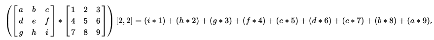
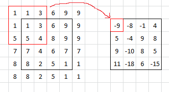
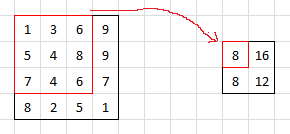
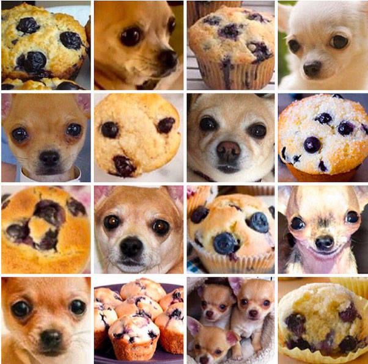
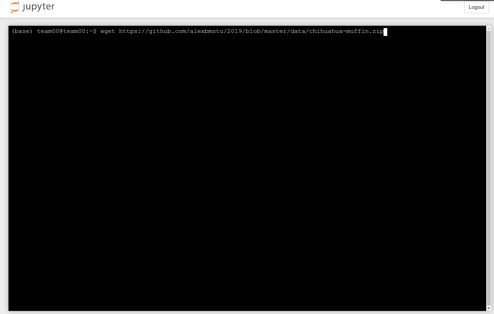
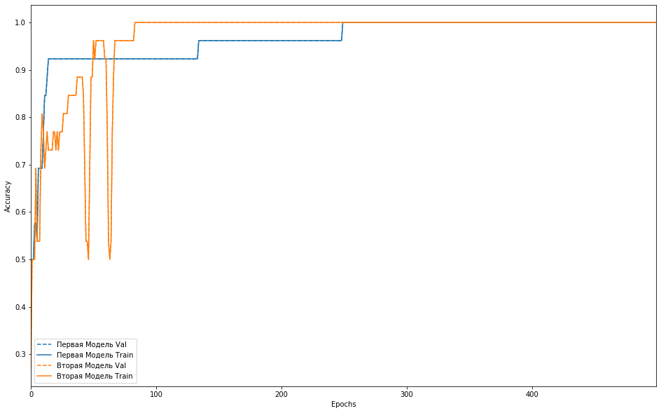

****
# День 4. Распознавание образов и компьютерное зрение <a name="5"></a>

Большая часть информации медицинского характера накапливается в графическом виде: снимки УЗИ, рентгеновские снимки, снимки эндоскопов и пр. Поэтому не менее важно использовать средств ИИ для распознавания образов на графической информации.

В этом задании мы рассмотрим средства и алгоритмы компьютерного зрения и решим тестовую задачу распозавания объектов на серии фотографий с использованием библиотек `Tensorflow` и `Keras`. 

## Нейронная сеть <a name="5_1"></a>

Нейронной сетью называется математическая модель, реализующая фукнции искусственного интеллекта путём воспроизведения нервной системы человека. Они используются для решения сложных задач, которые требуют аналитических вычислений, подобных тем, что делает человеческий мозг. К таким задачам относятся, например, классификация, кластеризация, прогнозирование, распознавание и т.д.

Искусственный нейрон представляет собой сумматор входных сигналов, применяющий к полученной взвешенной сумме некоторую простую функцию. Нейрон имеет синапсы - однонаправленные входные связи, соединённые с выходами других нейронов, а также аксон - выходную связь.

**Схема искусственного нейрона**
 
Текущее состояние нейрона определяется взвешенной суммой его входов (см. схему). Выход нейрона определяется его активационной функцией.

Совокупность нейронов, расположенных на одном уровне в нейронной сети, называется слоем. В общем случае нейронная сеть включает в себя входной, выходной и промежуточные слои. Нейроны входного и выходного слоёв, как правило, имеют линейную функцию активации и предназначены для приёма и передачи данных. Нейроны промежуточных слоёв - нелинейные; их функцией активации чаще всего является сигмоид (логистическая функция):


На схеме показан пример полносвязной нейронной сети, имеющей входной, промежуточный и выходной слои.


Нейронная сеть обучаема. В процессе обучения параметры сети настраиваются в соответствии с обучающими наборами данных, моделирующих среду, в которой будет функционировать сеть. В зависимости от способа подстройки параметров различают обучение с учителем и без учителя.

Обучение с учителем представляет собой предъявление сети выборки обучающих примеров. Каждый образец подаётся на входы сети, проходит обработку и перерабатывается в выходной сигнал, который сравнивается с эталонным значением. Затем в зависимости от степени расхождения реального и идеального результатов изменяются весовые коэффициенты связей внутри сети. Обучение длится до тех пор, пока ошибка по всему обучающему массиву не достигнет приемлемо низкого уровня.

При обучении без учителя обучающее множество состоит лишь из входных векторов. Алгоритм обучения подстраивает веса внутри сети так, чтобы предъявление достаточно близких входных векторов давало одинаковые результаты.

Почитать подробнее про нейронные сети можно [здесь](http://www.aiportal.ru/articles/neural-networks "Статьи о нейронных сетях").


## Серточны нейронные сети <a name="5_2"></a>

*Свёрточная нейронная сеть* — специальная архитектура искусственных нейронных сетей, основанные на представлении изображений в виде тензоров и нацеленная на эффективное распознавание образов в графических изображениях. Тензоры — это 3-х мерные массивы.

Для распознавания образов могут использоваться и простые модели нейронных сетей, такие как  многослойный персептрон. Однако, если размеры изображения велики, то число и сложность слоев нейронной сети многократно увеличивается, а процесс обучения существенно усложняется. Другим недостатком многослойных нейронных сетей является векторный характер представления данных, что делает невозможный двумерную локализации пикселей и обработку деталей на изображении.

Как и полносвязная нейронная сеть, свёрточная сеть обучается с помощью алгоритма обратного распространения ошибки. Сначала выполняется прямое распространение от первого слоя к последнему, после чего вычисляется ошибка на выходном слое и распространяется обратно. При этом на каждом слое вычисляются градиенты обучаемых параметров, которые в конце обратного распространения используются для обновления весов с помощью градиентного спуска.

Свёрточные нейронные сети состоят из последовательно соединенных слоев нескольких типов, выполняющими преобразования над поступающей матрицей или несколькими матрицами (например, исходное изображение представляется тремя матрицами R,G и B компонент цветности). Обычно, свёрточные НС построены на чередовании свёрточных слоёв, реализующих функцию свёртки, и субдискретизирующих слоёв, ответственных за выборку наиболее подходящего раздражителя — и тем самым уменьшающих размер обрабатываемого изображения. Также в сверточных НС используются элементы полносвязных персептронов: слои активации и полносвязные слои. Из слоев различных типов можно конструировать НС, наиболее подходящие для каждой конкретной задачи. 

### Серточный слой <a name="5_2_1"></a>

Когда входное изображение поступает на этот слой, к нему применяется операция свёртки, которая заключается в перемножении элементов фрагмента изображения с соответствующими элементами ядра свёртки и записью результата напротив центрального элемента фрагмента. Следующий пример показывает, как производится операция свёртки над изображением, в котором используется ядро размером 3х3:
 


где буквы *a - i* — соответствующие пиксели фрагмента изображения,

цифры 1-9 — соответствующие коэффициенты ядра функции свёртки,

[2,2] — координаты элемента, на место которого необходимо вставить получившуюся сумму попарных произведений.

В этом слое операция свёртки производится параллельно над каждым пикселем изображения. Если пиксель находится в углу или так, что одному или нескольким коэффициентам ядра нет соответствующего пикселя, применяют одну из двух стратегий:

а)	недостающие пиксели заполняются тем же значением, что и ближайший к нему пиксель изображения;

б)	такие пиксели отбрасываются и выходное изображение получается несколько меньшего размера.

Результаты применения этих двух стратегий и ядра 

показаны соответственно на рисунках:






**Результаты применений стратегий а и б применения операции свёртки к изображению. Черная рамка символизирует границы изображения, а красные – применяемое ядро и результат**

Иногда после свёрточного слоя вставляется так называемый слой *ReLU — Rectified Linear Unit* — блок линейной свёртки. Он состоит из матрицы активационных функций размером с выходное изображение. Активационные функции выбираются чаще всего не сигмоидальные, а ненасыщаемые функции вида F_акт (y)=max⁡(0,y) или F_акт (y)=〖βe〗^(-αy). 


## Библиотека Tensorflow <a name="5_3"></a>

*TensorFlow*  — это фреймворк машинного обучения, предоставляющий разработчикам функционал для сбора данных, а также для построения и обучения моделей, основанных на нейронных сетях. 
TensorFlow позволяет разработчикам создавать специальные обрабатывающие структуры - графы потоков данных, которые описывают, как данные перемещаются через последовательность узлов обработки. Каждый узел в графе представляет математическую операцию, а каждое соединение между узлами представляет собой многомерный массив данных или тензор.

TensorFlow использует синтаксис языка Python, т.к. он прост в освоении и предоставляет удобные способы выражения алгоритмов действий в виде высокоуровневых абстракций. Узлы и тензоры в TensorFlow являются объектами Python, а приложения TensorFlow являются Python-приложениями. Однако, для повышения производительности обработки данных, TensorFlow написан на языке C++ и скомпилирован в бинарные файлы. Python используется лишь для упрощения синтаксических конструкций и использования высокоуровневых программных абстракций.

Приложения TensorFlow можно запускать как на локальном компьютере, так и в облачном кластере, на устройствах iOS и Android, на мобильных процессорах, встраиваемых системах типа RaspberryPi или графических процессорах. Полученные в результате исследований модели TensorFlow могут быть развернуты на любом устройстве, где они будут использоваться для рапознавания и формирования прогнозов.

## Пример использования Tensorflow и Keras<a name="5_4"></a>

Мы разработаем программный код для распознавания объектов на фотографиях. Будем использовать небольшую обучающую выборку задачи распознавания :


**Классика жанра**

Загрузите архив с графическими файлами на сервер:

```shell
wget https://github.com/alexbmstu/2019/raw/master/data/chihuahua-muffin.zip
unzip chihuahua-muffin.zip
cd chihuahua-muffin
```

Вы можете использовать терминал из Jupyter Notebooks.


**Терминал Jupyter Notebooks**

или перенесите файлы любым другим способом:

- [Изображения](data/chihuahua-muffin.zip)

Подключим необходимые библиотеки Tensorflow и keras

```python
 # TensorFlow and tf.keras
import tensorflow as tf
from tensorflow import keras
 #import keras.utils
from keras import utils as np_utils
from keras.models import Sequential
from keras.layers import Dense, Dropout, Activation
from keras.optimizers import SGD

 # Helper libraries
import numpy as np
import matplotlib.pyplot as plt
import glob, os
import re

 # Pillow
import PIL
from PIL import Image
```

Цветность изоражения необходимо преобразовать в 8-бит Grayscale. Также приведем все изображения к одинаковому размеру 100х100 пикселей.

```python
 # Use Pillow library to convert an input jpeg to a 8 bit grey scale image array for processing.
def jpeg_to_8_bit_greyscale(path, maxsize):
        img = Image.open(path).convert('L')   # convert image to 8-bit grayscale
        # Make aspect ratio as 1:1, by applying image crop.
    # Please note, croping works for this data set, but in general one
    # needs to locate the subject and then crop or scale accordingly.
        WIDTH, HEIGHT = img.size
        if WIDTH != HEIGHT:
                m_min_d = min(WIDTH, HEIGHT)
                img = img.crop((0, 0, m_min_d, m_min_d))
        # Scale the image to the requested maxsize by Anti-alias sampling.
        img.thumbnail(maxsize, PIL.Image.ANTIALIAS)
        return np.asarray(img)
    
def load_image_dataset(path_dir, maxsize):
        images = []
        labels = []
        os.chdir(path_dir)
        for file in glob.glob("*.jpg"):
                img = jpeg_to_8_bit_greyscale(file, maxsize)
                if re.match('chihuahua.*', file):
                        images.append(img)
                        labels.append(0)
                elif re.match('muffin.*', file):
                        images.append(img)
                        labels.append(1)
        return (np.asarray(images), np.asarray(labels))
```

Загрузим изображения в датасеты

```python
maxsize_w = 100
maxsize_h = 100

maxsize = maxsize_w, maxsize_h

(train_images, train_labels) = load_image_dataset('путь к директории train_set', maxsize)

(test_images, test_labels) = load_image_dataset('путь к директории test_set', maxsize)
```

Посмотрим на параметры обучающей выборки изображений:

```python
train_images.shape
```

Набор меток в обучающей выборке:

```python
print(test_labels)
[0 0 0 1 1 1 0 1 0 1 1 0 0 1]
```

Нам монадобится функция вывода таблицы изображений:

```python
class_names = ['chihuahua', 'muffin']
def display_images(images, labels):
        plt.figure(figsize=(10,10))
        grid_size = min(25, len(images))
        for i in range(grid_size):
                plt.subplot(5, 5, i+1)
                plt.xticks([])
                plt.yticks([])
                plt.grid(False)
                plt.imshow(images[i], cmap=plt.cm.binary)
                plt.xlabel(class_names[labels[i]])
```

Выведем обучающую выборку:

```python
display_images(train_images, train_labels)
plt.show()
```

Создадим и обучим модель `first_model`:

```python
train_images = train_images / 255.0
test_images = test_images / 255.0

 # Setting up the layers.

first_model = keras.Sequential([
    keras.layers.Flatten(input_shape=(100, 100)),
        keras.layers.Dense(128, activation=tf.nn.sigmoid),
        keras.layers.Dense(16, activation=tf.nn.sigmoid),
    keras.layers.Dense(2, activation=tf.nn.softmax)
])
sgd = keras.optimizers.SGD(lr=0.01, decay=1e-5, momentum=0.7, nesterov=True)

first_model.compile(optimizer=sgd,
              loss='sparse_categorical_crossentropy',
              metrics=['accuracy'])

first_model_history=first_model.fit(train_images, train_labels, epochs=100)
```

Оценим точность модели:

```python
test_loss, test_acc = model.evaluate(test_images, test_labels)
print('Test accuracy:', test_acc)
```

Сформируем метки для изображений тестовой выборки по полученной модели и выведем то, что получилось:

```python
predictions = model.predict(test_images)
display_images(test_images, np.argmax(predictions, axis = 1))
plt.show()
```

Создайте альтернативную модель second_model и используйте функцию `fit` для ее обучения:

```python
second_model_history=second_model.fit(train_images, train_labels, epochs=100)
```

Сравните модели 

```python
def plot_history(histories, key='accuracy'):
  plt.figure(figsize=(16,10))

  for name, history in histories:
    val = plt.plot(history.epoch, history.history[key],
                   '--', label=name.title()+' Val')
    plt.plot(history.epoch, history.history[key], color=val[0].get_color(),
             label=name.title()+' Train')

  plt.xlabel('Epochs')
  plt.ylabel(key.replace('_',' ').title())
  plt.legend()

  plt.xlim([0,max(history.epoch)])
```

```python
plot_history([('Первая модель', first_model_history),
              ('Вторая модель', second_model_history)])
```


**Сравнение истории обучения моделей**


## Задание <a name="5_5"></a>

1) Разработайте 4-6 различных моделей, меняя количество эпох обучения и свойства изображения.

2) Добейтесь точности распознавания >=92%.


**Дополнительные источники литературы по данному разделу:**


- [Basic classification: Classify images of clothing](https://www.tensorflow.org/tutorials/keras/classification)

- [Что такое Keras](https://neurohive.io/ru/tutorial/nejronnaya-set-keras-python/)

- [List of datasets for machine-learning research](https://en.wikipedia.org/wiki/List_of_datasets_for_machine-learning_research)

- [Как работает сверточная нейронная сеть](https://neurohive.io/ru/osnovy-data-science/glubokaya-svertochnaja-nejronnaja-set/)

- [Курс по машинному обучению](https://github.com/bogdansalyp/ml_course)	

