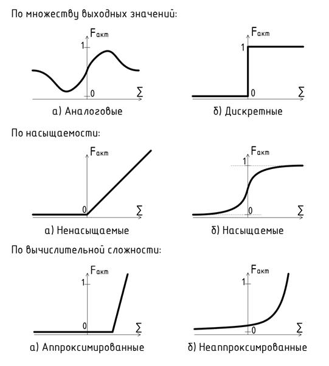
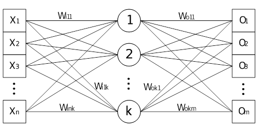
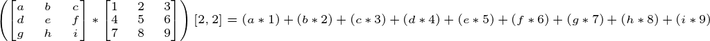
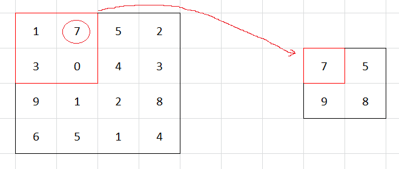

****
# День 4. Распознавание образов и компьютерное зрение <a name="5"></a>

## Введение  <a name="5_0"></a>

Рост населения в крупных городах и быстро растущая информатизация городских сфер требует современного подхода к обеспечению безопасности в городской среде. В этом контексте глубокое обучение и сверточные нейронные сети, решая проблемы компьютерного зрения, используются в задачах распознавания объектов на изображениях  и определения их свойств. 

Для контроля городского пространства все чаще используются камеры видеонаблюдения для захвата и удержания - обнаружения объектов и их взаимосвязь. Визуальное отношение отражает взаимодействие между объектами в видеопотоке («человек несет чемодан» или «человек оставил чемодан»). 

### Постановка задачи  <a name="5_0_1"></a>

Дана видеозапись или видеопоток с камеры видеонаблюдения. По результатам 4 дня  требуется обнаружить и классифицировать людей и рюкзаки на данных видеозаписи или видеопотоке.

## Нейронная сеть <a name="5_1"></a>

Нейронной сетью называется математическая модель, реализующая фукнции искусственного интеллекта путём воспроизведения нервной системы человека. Они используются для решения сложных задач, которые требуют аналитических вычислений, подобных тем, что делает человеческий мозг. К таким задачам относятся, например, классификация, кластеризация, прогнозирование, распознавание и т.д.

Искусственный нейрон представляет собой сумматор входных сигналов, применяющий к полученной взвешенной сумме некоторую простую функцию. Нейрон имеет синапсы - однонаправленные входные связи, соединённые с выходами других нейронов, а также аксон - выходную связь.


**Схема искусственного нейрона**
 

Текущее состояние нейрона определяется взвешенной суммой его входов (см. схему). Выход нейрона определяется его активационной функцией.
Существует несколько вариантов функций активанции.




Чаще всего для свёрточных нейронных сетей используются сигмоидальные функции или их приближения:

-	логистическая функция;

-	гиперболический тангенс;

-	линейно-пороговая функция.

Сигмоидальные и подобные им функции хороши тем, что позволяют усиливать слабые сигналы и не насыщаться от сильных сигналов. 


Совокупность нейронов, расположенных на одном уровне в нейронной сети, называется слоем. В общем случае нейронная сеть включает в себя входной, выходной и промежуточные слои. Нейроны входного и выходного слоёв, как правило, имеют линейную функцию активации и предназначены для приёма и передачи данных. Нейроны промежуточных слоёв - нелинейные; их функцией активации чаще всего является сигмоид (логистическая функция):


На схеме показан пример полносвязной нейронной сети, имеющей входной, промежуточный и выходной слои.




Нейронная сеть обучаема. В процессе обучения параметры сети настраиваются в соответствии с обучающими наборами данных, моделирующих среду, в которой будет функционировать сеть. В зависимости от способа подстройки параметров различают обучение с учителем и без учителя.

Обучение с учителем представляет собой предъявление сети выборки обучающих примеров. Каждый образец подаётся на входы сети, проходит обработку и перерабатывается в выходной сигнал, который сравнивается с эталонным значением. Затем в зависимости от степени расхождения реального и идеального результатов изменяются весовые коэффициенты связей внутри сети. Обучение длится до тех пор, пока ошибка по всему обучающему массиву не достигнет приемлемо низкого уровня.

При обучении без учителя обучающее множество состоит лишь из входных векторов. Алгоритм обучения подстраивает веса внутри сети так, чтобы предъявление достаточно близких входных векторов давало одинаковые результаты.

Почитать подробнее про нейронные сети можно [здесь](http://www.aiportal.ru/articles/neural-networks "Статьи о нейронных сетях").


## Сверточные нейронные сети <a name="5_2"></a>

*Свёрточная нейронная сеть* — специальная архитектура искусственных нейронных сетей, основанные на представлении изображений в виде тензоров и нацеленная на эффективное распознавание образов в графических изображениях. Тензоры — это 3-х мерные массивы.

Для распознавания образов могут использоваться и простые модели нейронных сетей, такие как  многослойный персептрон. Однако, если размеры изображения велики, то число и сложность слоев нейронной сети многократно увеличивается, а процесс обучения существенно усложняется. Другим недостатком многослойных нейронных сетей является векторный характер представления данных, что делает невозможный двумерную локализации пикселей и обработку деталей на изображении.

Как и полносвязная нейронная сеть, свёрточная сеть обучается с помощью алгоритма обратного распространения ошибки. Сначала выполняется прямое распространение от первого слоя к последнему, после чего вычисляется ошибка на выходном слое и распространяется обратно. При этом на каждом слое вычисляются градиенты обучаемых параметров, которые в конце обратного распространения используются для обновления весов с помощью градиентного спуска.

Свёрточные нейронные сети состоят из последовательно соединенных слоев нескольких типов, выполняющими преобразования над поступающей матрицей или несколькими матрицами (например, исходное изображение представляется тремя матрицами R,G и B компонент цветности). Обычно, свёрточные НС построены на чередовании свёрточных слоёв, реализующих функцию свёртки, и субдискретизирующих слоёв, ответственных за выборку наиболее подходящего раздражителя — и тем самым уменьшающих размер обрабатываемого изображения. Также в сверточных НС используются элементы полносвязных персептронов: слои активации и полносвязные слои. Из слоев различных типов можно конструировать НС, наиболее подходящие для каждой конкретной задачи. 

### Сверточный слой <a name="5_2_1"></a>

Когда входное изображение поступает на этот слой, к нему применяется операция свёртки, которая заключается в перемножении элементов фрагмента изображения с соответствующими элементами ядра свёртки и записью результата напротив центрального элемента фрагмента. Следующий пример показывает, как в практических приложениях производится операция свёртки над изображением с ядром размером 3х3:
 


где буквы *a - i* — соответствующие пиксели фрагмента изображения, цифры 1-9 — соответствующие коэффициенты ядра функции свёртки, [2,2] — координаты элемента, на место которого необходимо вставить получившуюся сумму попарных произведений.

В этом слое операция свёртки производится параллельно над каждым пикселем изображения. Если пиксель находится в углу или так, что одному или нескольким коэффициентам ядра нет соответствующего пикселя, применяют одну из двух стратегий:

а.	недостающие пиксели заполняются тем же значением, что и ближайший к нему пиксель изображения;

б.	такие пиксели отбрасываются и выходное изображение получается несколько меньшего размера.

Результаты применения стратегии a) свертки и ядра 2x2

показаны соответственно на рисунках:


**Результаты применений стратегий а) свертки к изображению.**


Иногда после свёрточного слоя вставляется так называемый слой *ReLU — Rectified Linear Unit* — блок линейной свёртки. Он состоит из матрицы активационных функций размером с выходное изображение. Активационные функции выбираются чаще всего не сигмоидальные, а ненасыщаемые функции вида 


или

. 

Цель применения свёрточного слоя — выявить общие детали множества изображений. Так как ядра свёртки обучаются под общие детали, влияние шума на них минимизируется по сравнению с многослойным перцептроном. В них для каждого входного слоя есть соединение с каждым нейтроном на входном слое, тем самым способствуя обучению и общим и частным деталям.

Таким образом использование свёрточных слоёв позволяет расположить нейросеть к выделению более общих частей по сравнению с перцептроном, вместе с тем занимая меньше места при хранении и в оперативной памяти, так как хранятся не сонмы связей, а небольшое количество ядер свёртки.

Добавление блока ReLU позволяет ещё сильнее снизить влияние входно-го шума на выход слоя, тем самым упрощая работу при обучении.


### Субдискретизирующий слой <a name="5_2_2"></a>

Слой субдискретизации служит для уменьшения изображения посредством нелинейных преобразований. Идея, положенная в основу создания этого слоя такова: когда свёрточный слой выявил признаки, чрезмерно высокую детализацию можно отсечь и получить на выходе только общую картину.

Этот слой не является необходимым в свёрточных нейронных сетях, и иногда опускается, однако его использование даёт выигрыш по скорости работы и обучения слоёв, идущим за ним. Можно сказать, что этот слой помогает свёрточной нейронной сети абстрагироваться от деталей и частично увидеть общую картину.

Слой субдискретизации характеризуется следующими параметрами:

а)	размер субдискретизируемой группы пикселей – обычно 2х2;

б)	шаг применения функции дискретизации – обычно равен ширине субдискретизируемой группы пикселей, то есть двум;

в)	функция субдискретизации – обычно выбирается максимальное значение из группы пикселей, но бывает выборка минимума или выборка среднего арифметического значения.

Принцип работы этого слоя представлен на рисунке ниже: к группе пиксе-лей, например, 2х2, применяется функция субдискретизации, в текущем случае – выборка максимального значения. Результат функции субдискретизации, применённой к группе пикселей входного изображения, записывается в единственный пиксель выходного изображения.


**Результат применения слоя субдискретизации к изображению**

Если перед субдискретизирующим слоем уже стоял блок ReLU, бессмысленно ставить такой же после этого слоя, так как выходное значение не изменится. Если блок ReLU будет использовать иную активационную функцию, значение изменится, но того же эффекта можно было бы добиться, изменив функцию предыдущего блока.

Таким образом, после слоя субдискретизации обыкновенно не ставят слой ReLU. Применение субдискретизирующего слоя заключается в упрощении дальнейшей обработки изображения, проходящего по конвейеру и в вычленении общих деталей изображения.


### Обучение НС <a name="5_2_3"></a>

Процесс некоторого определённого изменения весов связей нейронов и значений элементов свёрточных слоёв с целью получения некоторой опреде-лённой реакции нейронной сети на входные данные именуется обучением НС. Оно происходит до тех пор, пока не наступит определённое условие, чаще всего – процент ошибок на обучающем наборе должен опуститься ниже определённого значения.

Ниже приведена классификация способов обучения НС:

а.	по наличию элемента случайности:

  1.	детерминистские методы – процедура обучения НС основана на использовании текущих значений весов нейронов и элементов ядер свёртки и желаемом выходе сети;

  2.	стохастические методы – процедура обучения НС основана на случайном изменении весов в соответствии с определён-ной функцией распределения;

б.	по способу определения корректности результата:

  1.	с учителем – процедура обучения НС основана на одновре-менной подаче входных и выходных данных. Если выход нейронной сети совпадает с требуемым, то берётся следую-щий набор данных, в противном случае нейронная сеть до-обучается;

  2.	с последовательным подкреплением знаний – процедура обучения НС основана на подаче входных данных и последующей оценке выходных данных. Оценка бывает либо вида «хорошо-плохо», либо численной;

  3.	без учителя – .процедура обучения НС основана на подаче входных данных, а дальше нейронная сеть сама пытается вы-членить особенности входных данных.

Методов обучения, попадающих под эту классификацию, очень много, однако для используемой свёрточной НС наиболее подходящий и наиболее популярный – метод обратного распространения ошибки. Он применим только к НС с прямым распространением сигнала, то есть без обратных связей, и используемая НС является таковой.

Алгоритм обратного распространения ошибки следующий:

а.	инициализировать веса нейронов и фильтров маленькими случай-ными значениями;

б.	выбрать очередную обучающую пару из обучающего множества; подать входной вектор на вход сети;

в.	вычислить выход сети;

г.	вычислить разность между выходом сети и требуемым выходом;

д.	подкорректировать веса сети для минимизации ошибки;

е.	Повторять шаги со второго по пятый для каждой пары обучающего множества до тех пор, пока ошибка на всем множестве не достигнет приемлемого уровня.

Шаги б) и в) образуют так называемый «проход вперёд», так как сигнал распространяется по сети от входа к выходу. Шаги г) и д) составляют «обратный проход», здесь вычисляемый сигнал ошибки распространяется обратно по сети и используется для подстройки весов.

При обучении НС следует избегать переобучения НС, когда на обучаю-щей выборке ошибок почти нет, а на реальных данных возникает крайне силь-ное расхождение, то есть стоит избегать слишком сильной «подгонки» резуль-татов работы НС под входные данные.

## Библиотека PyTorch <a name="5_3"></a>

*PyTorch* - это фреймворк машинного обучения для языка Python, созданный на базе библиотеки *Torch*. Фреймворк предоставляет разработчикам функционал для сбора данных, а также для построения и обучения моделей, основанных на нейронных сетях.

PyTorch предоставляет две основные высокоуровневые модели:
- Тензорные вычисления (по аналогии с NumPy) с развитой поддержкой ускорения на GPU;
- Глубокие нейронные сети на базе системы autodiff.

Тензоры в PyTorch представляют собой многомерные массивы. Они похожи на массивы пакета *numpy*, но дополнительно могут обрабатываться на видеоускорителях.

PyTorch создан на базе библиотеки *Torch*, написанная для языка Lua, ядро которой написано на языке Си. Таким образом, язык Python в PyTorch используется для упрощения синтаксических конструкций и использования высокоуровневых программных абстракций.

Приложения PyTorch можно запускать как на локальном компьютере, так и в облачном кластере, на устройствах iOS и Android, на мобильных процессорах, встраиваемых системах типа RaspberryPi или графических процессорах. Полученные в результате исследований модели PyTorch могут быть развернуты на любом устройстве, где они будут использоваться для рапознавания и формирования прогнозов.

## Поиск объектов на изображении с использованием PyTorch <a name="5_4"></a>

Итак, задачи компьютерного зрения включают в себя следующие направления:

- Localization (обнаружение объекта)
- Classification (классификация объекта)
- Identification (идентификация объекта)
- Оbject recognition (распознавание объекта)
- Object detection (обнаружение и классификация объекта)
- Object tracking (отслеживание объекта)
- Instance segmentation (попиксельное обнаружение всех объектов)
- Semantic segmentation (обнаружение границ всех объектов)
- Image segmentation (обнаружение границ объекта)

Мы разработаем программный код для решения задачи Object detection. 

Object Detection — это просто определение объектов на картинке/кадре. То есть алгоритм или нейронная сеть определяют объект и записывают его позицию и bounding boxes (параметры прямоугольников вокруг объектов). Пока что речи о других кадрах не идет, и алгоритм работает только с одним.

Пример:


Потребуется разобраться со следующими проблемами:

1) Найти набор данных для обучения и валидации под поставленную задачу
2) Выбрать модель для решения задачи Object detection
3) Приготовить найденный набор для выбранной модели
4) Настроить параметры обучения в аргументах командной строки
5) Запустить проверку обученной модели на выбранной видеозаписи

Итак, поехали!

### Настройка окружения <a name="5_4_0"></a>

Настройка собственного окружения для работы над проектом требуется из-за специфики мира Python и его зависимостей или пакетов, версий которых (даже для одного пакета) существует бесчисленное множество. Поэтому желательно иметь набор зависиместей исключительно под тот проект, над которым сейчас ведется разработка, и нежелательно засорять системное хранилище зависимостей. Простой пример: в ОС может вестись работа над несколькими проектами, каждый из которых не только использует один и тот же пакет разных версий, но и не может работать с пакетом иной версии. 

- Установить окружение ```conda create --name py35 python=3.5```
- Зайти в окружение ```source activate py35```
- Выйти из окружения ```source deactivate```
- итд [CONDA CHEAT SHEET](https://docs.conda.io/projects/conda/en/4.6.0/_downloads/52a95608c49671267e40c689e0bc00ca/conda-cheatsheet.pdf "Шпаргалка по conda")

Можно использовать ```pyenv``` - выбирать вам.

### Поиск набора данных <a name="5_4_1"></a>

Нашим набором данных для тренировки и валидации будет является массив изображений людей (Person) и рюкзаков (Backpack). 

Популярным источником изображений для формирования собственного набора данных является [Open Images Dataset](https://storage.googleapis.com/openimages/web/index.html "Набор данных тут"). 

Наборы данных по категориям можно посмотреть тут [Поиск ихображений по категориям](https://storage.googleapis.com/openimages/web/visualizer/index.html?set=train&type=segmentation&r=false&c=%2Fm%2F0cyhj_ "Тут можно найти апельсины").

К сожалению, данный источник не предоставляет какого-то удобного инструмента для загрузки исключительно требуемых категорий изображений.

Решить эту проблему нам поможет следующий репозиторий на GitHub: [OIDv4 ToolKit](https://github.com/EscVM/OIDv4_ToolKit/ "Инструмент юного кастомайзера датасетов").

Требуется ознакомиться с документацией в этом репозитории, а именно: Какая структура папок после загрузки требуемых категорий изображений?

Для загрузки наборов данных (Person и Backpack) выполните следующую команду (также обратите внимани на документацию параметров командной строки):

```python3 main.py downloader --classes Person Backpack --type_csv validation```

И следуйте инструкциям на экране (подсказка: соглашайтесь на все :-) ).

Вопрос с набором данных решен! (нет)

### Выбор модели <a name="5_4_2"></a>

Довольно популярным (хотя уже и старым) решением задачи Object Detection является проект YOLO.

- Официальный веб-сайт: https://pjreddie.com/darknet/yolo/
- Научная публикация с описанием модели: https://arxiv.org/pdf/1804.02767v1.pdf
- Исходный код для обучения, валидации и тестирования модели: https://github.com/eriklindernoren/PyTorch-YOLOv3/ 

Небольшое отступление (необязательно к прочтению):
> На самом деле история проекта очень мудреная.

> История проекта описана здесь: 
> https://medium.com/towards-artificial-intelligence/yolo-v5-is-here-custom-object-detection-tutorial-with-yolo-v5-12666ee1774e 

> Официально существует всего 3 версии YOLO (со ссылками на научные публикации):
> - YOLOv1 (https://arxiv.org/pdf/1506.02640.pdf)
> - YOLOv2 (https://arxiv.org/pdf/1612.08242.pdf) 
> - YOLOv3 (https://arxiv.org/abs/1804.02767v1)

> После третьей версии автор проекта остановил разработку, предложив сообществу развивать проект в свободном от него формате. Таким образом, неофициально сущесвует еще 2 версии YOLO:
> - YOLOv4 (https://arxiv.org/pdf/2004.10934)
> - YOLOv5 (https://github.com/ultralytics/yolov5) 

Почему YOLO? Да потому что YOLO считается эффективнее многих других алгоритмов для определения объектов. 

Основная идея YOLO сделать за один проход классификацию того, что может быть на картинке, а потом впаять BB (bounding boxes). Таким образом, мы можем использовать любую архитектуру классификатора, как-то подготовленную для YOLO.
 

### Подготовка набора данных <a name="5_4_3"></a>

Для обучения модели необходимо подготовить данные.
Оригинальная директория с набором данных выглядит следующим образом:

```
- Dataset
	- validation
		- Backpack
			- Label
				- 123.txt
				- 456.txt
				- …
			- 123.jpg
			- 456.jpg
			- …
			- train.txt
			- val.txt
```
*Backpack* - класс изображений

Файлы папки *Labels* содержат следующую информацию об ограничивающих прямоугольниках в каждом изображении:
`<номер класса> <x> <y> <длина прямоугольника> <ширина прямоугольника> `

*x, y* - координаты середины прямоугольника относительно реального размера изображения.
Длина и ширина прямоугольника также даны относительно реального размера изображения.

Директорию с данными нужно привести к следующему виду:

```
- dataset
	- images
		- 123.jpeg
		- 456.jpeg
		- …
	- labels
		- 123.txt
		- 456.txt
		- …
	- train.txt
	- validation.txt
```

Папка *images* содержит набор данных, который будет подаваться на вход модели во время ее обучения или валидации.
Папка *labels* содержит текстовые файлы, названия которых соответствуют названиям набора данных из папки *images*. Эти файлы должны содержать следующую информацию о каждом ограничивающем прямоугольнике в отдельной строке файла:
`<Название класса> <x1> <y1> <x2> <y2>`
*x1, y1, x2, y2* - координаты ограничивающего прямоугольника. Диапазон координат - [0, 1].

В скачанном датасете информация об ограничивающих прямоугольниках не нормализована, то есть координаты ограничивающих прямоугольников даны относительно настоящего размера изображения. В данном случае эти данные нужно нормализовать.
Пример: `Backpack 0.4577515 0.486005 0.915503 0.971942`.

Файлы *train.txt* и *validation.txt* содержат в каждой отдельной строке названия изображений из папки *images* для тренировки и валидации модели соответственно.


### Настройка параметров обучения <a name="5_4_4"></a>


### Проверка обученной модели <a name="5_4_5"></a>


