****
# День 4. Распознавание образов и компьютерное зрение <a name="5"></a>

## Введение  <a name="5_0"></a>

Рост населения в крупных городах и быстро растущая информатизация городских сфер требует современного подхода к обеспечению безопасности в городской среде. В этом контексте глубокое обучение и сверточные нейронные сети, решая проблемы компьютерного зрения, используются в задачах распознавания объектов на изображениях  и определения их свойств. 

Для контроля городского пространства все чаще используются камеры видеонаблюдения для захвата и удержания - обнаружения объектов и их взаимосвязи. Визуальное отношение отражает взаимодействие между объектами в видеопотоке («человек несет чемодан» или «человек оставил чемодан»). 

## Нейронная сеть <a name="5_1"></a>

Нейронной сетью называется математическая модель, реализующая фукнции искусственного интеллекта путём воспроизведения нервной системы человека. Они используются для решения сложных задач, которые требуют аналитических вычислений, подобных тем, что делает человеческий мозг. К таким задачам относятся, например, классификация, кластеризация, прогнозирование, распознавание и т.д.

Искусственный нейрон представляет собой сумматор входных сигналов, применяющий к полученной взвешенной сумме некоторую простую функцию. Нейрон имеет синапсы - однонаправленные входные связи, соединённые с выходами других нейронов, а также аксон - выходную связь.


**Схема искусственного нейрона**
 

Текущее состояние нейрона определяется взвешенной суммой его входов (см. схему). Выход нейрона определяется его активационной функцией.
Существует несколько вариантов функций активанции.


Чаще всего для свёрточных нейронных сетей используются сигмоидальные функции или их приближения:

-	логистическая функция;

-	гиперболический тангенс;

-	линейно-пороговая функция.

Сигмоидальные и подобные им функции хороши тем, что позволяют усиливать слабые сигналы и не насыщаться от сильных сигналов. 


Совокупность нейронов, расположенных на одном уровне в нейронной сети, называется слоем. В общем случае нейронная сеть включает в себя входной, выходной и промежуточные слои. Нейроны входного и выходного слоёв, как правило, имеют линейную функцию активации и предназначены для приёма и передачи данных. Нейроны промежуточных слоёв - нелинейные; их функцией активации чаще всего является сигмоид (логистическая функция):


На схеме показан пример полносвязной нейронной сети, имеющей входной, промежуточный и выходной слои.


Нейронная сеть обучаема. В процессе обучения параметры сети настраиваются в соответствии с обучающими наборами данных, моделирующих среду, в которой будет функционировать сеть. В зависимости от способа подстройки параметров различают обучение с учителем и без учителя.

Обучение с учителем представляет собой предъявление сети выборки обучающих примеров. Каждый образец подаётся на входы сети, проходит обработку и перерабатывается в выходной сигнал, который сравнивается с эталонным значением. Затем в зависимости от степени расхождения реального и идеального результатов изменяются весовые коэффициенты связей внутри сети. Обучение длится до тех пор, пока ошибка по всему обучающему массиву не достигнет приемлемо низкого уровня.

При обучении без учителя обучающее множество состоит лишь из входных векторов. Алгоритм обучения подстраивает веса внутри сети так, чтобы предъявление достаточно близких входных векторов давало одинаковые результаты.

Почитать подробнее про нейронные сети можно [здесь](http://www.aiportal.ru/articles/neural-networks "Статьи о нейронных сетях").


## Сверточные нейронные сети <a name="5_2"></a>

*Свёрточная нейронная сеть* — специальная архитектура искусственных нейронных сетей, основанные на представлении изображений в виде тензоров и нацеленная на эффективное распознавание образов в графических изображениях. Тензоры — это 3-х мерные массивы.

Для распознавания образов могут использоваться и простые модели нейронных сетей, такие как  многослойный персептрон. Однако, если размеры изображения велики, то число и сложность слоев нейронной сети многократно увеличивается, а процесс обучения существенно усложняется. Другим недостатком многослойных нейронных сетей является векторный характер представления данных, что делает невозможный двумерную локализации пикселей и обработку деталей на изображении.

Как и полносвязная нейронная сеть, свёрточная сеть обучается с помощью алгоритма обратного распространения ошибки. Сначала выполняется прямое распространение от первого слоя к последнему, после чего вычисляется ошибка на выходном слое и распространяется обратно. При этом на каждом слое вычисляются градиенты обучаемых параметров, которые в конце обратного распространения используются для обновления весов с помощью градиентного спуска.

Свёрточные нейронные сети состоят из последовательно соединенных слоев нескольких типов, выполняющими преобразования над поступающей матрицей или несколькими матрицами (например, исходное изображение представляется тремя матрицами R,G и B компонент цветности). Обычно, свёрточные НС построены на чередовании свёрточных слоёв, реализующих функцию свёртки, и субдискретизирующих слоёв, ответственных за выборку наиболее подходящего раздражителя — и тем самым уменьшающих размер обрабатываемого изображения. Также в сверточных НС используются элементы полносвязных персептронов: слои активации и полносвязные слои. Из слоев различных типов можно конструировать НС, наиболее подходящие для каждой конкретной задачи. 

### Сверточный слой <a name="5_2_1"></a>

Когда входное изображение поступает на этот слой, к нему применяется операция свёртки, которая заключается в перемножении элементов фрагмента изображения с соответствующими элементами ядра свёртки и записью результата напротив центрального элемента фрагмента. Следующий пример показывает, как в практических приложениях производится операция свёртки над изображением с ядром размером 3х3:
 


где буквы *a - i* — соответствующие пиксели фрагмента изображения, цифры 1-9 — соответствующие коэффициенты ядра функции свёртки, [2,2] — координаты элемента, на место которого необходимо вставить получившуюся сумму попарных произведений.

В этом слое операция свёртки производится параллельно над каждым пикселем изображения. Если пиксель находится в углу или так, что одному или нескольким коэффициентам ядра нет соответствующего пикселя, применяют одну из двух стратегий:

а.	недостающие пиксели заполняются тем же значением, что и ближайший к нему пиксель изображения;

б.	такие пиксели отбрасываются и выходное изображение получается несколько меньшего размера.

Результаты применения стратегии a) свертки и ядра 2x2

показаны соответственно на рисунках:


**Результаты применений стратегий а) свертки к изображению.**


Иногда после свёрточного слоя вставляется так называемый слой *ReLU — Rectified Linear Unit* — блок линейной свёртки. Он состоит из матрицы активационных функций размером с выходное изображение. Активационные функции выбираются чаще всего не сигмоидальные, а ненасыщаемые функции вида 


или

. 

Цель применения свёрточного слоя — выявить общие детали множества изображений. Так как ядра свёртки обучаются под общие детали, влияние шума на них минимизируется по сравнению с многослойным перцептроном. В них для каждого входного слоя есть соединение с каждым нейтроном на входном слое, тем самым способствуя обучению и общим и частным деталям.

Таким образом использование свёрточных слоёв позволяет расположить нейросеть к выделению более общих частей по сравнению с перцептроном, вместе с тем занимая меньше места при хранении и в оперативной памяти, так как хранятся не сонмы связей, а небольшое количество ядер свёртки.

Добавление блока ReLU позволяет ещё сильнее снизить влияние входно-го шума на выход слоя, тем самым упрощая работу при обучении.


### Субдискретизирующий слой <a name="5_2_2"></a>

Слой субдискретизации служит для уменьшения изображения посредством нелинейных преобразований. Идея, положенная в основу создания этого слоя такова: когда свёрточный слой выявил признаки, чрезмерно высокую детализацию можно отсечь и получить на выходе только общую картину.

Этот слой не является необходимым в свёрточных нейронных сетях, и иногда опускается, однако его использование даёт выигрыш по скорости работы и обучения слоёв, идущим за ним. Можно сказать, что этот слой помогает свёрточной нейронной сети абстрагироваться от деталей и частично увидеть общую картину.

Слой субдискретизации характеризуется следующими параметрами:

а)	размер субдискретизируемой группы пикселей – обычно 2х2;

б)	шаг применения функции дискретизации – обычно равен ширине субдискретизируемой группы пикселей, то есть двум;

в)	функция субдискретизации – обычно выбирается максимальное значение из группы пикселей, но бывает выборка минимума или выборка среднего арифметического значения.

Принцип работы этого слоя представлен на рисунке ниже: к группе пиксе-лей, например, 2х2, применяется функция субдискретизации, в текущем случае – выборка максимального значения. Результат функции субдискретизации, применённой к группе пикселей входного изображения, записывается в единственный пиксель выходного изображения.


**Результат применения слоя субдискретизации к изображению**

Если перед субдискретизирующим слоем уже стоял блок ReLU, бессмысленно ставить такой же после этого слоя, так как выходное значение не изменится. Если блок ReLU будет использовать иную активационную функцию, значение изменится, но того же эффекта можно было бы добиться, изменив функцию предыдущего блока.

Таким образом, после слоя субдискретизации обыкновенно не ставят слой ReLU. Применение субдискретизирующего слоя заключается в упрощении дальнейшей обработки изображения, проходящего по конвейеру и в вычленении общих деталей изображения.


### Обучение НС <a name="5_2_3"></a>

Процесс некоторого определённого изменения весов связей нейронов и значений элементов свёрточных слоёв с целью получения некоторой опреде-лённой реакции нейронной сети на входные данные именуется обучением НС. Оно происходит до тех пор, пока не наступит определённое условие, чаще всего – процент ошибок на обучающем наборе должен опуститься ниже определённого значения.

Ниже приведена классификация способов обучения НС:

а.	по наличию элемента случайности:

  1.	детерминистские методы – процедура обучения НС основана на использовании текущих значений весов нейронов и элементов ядер свёртки и желаемом выходе сети;

  2.	стохастические методы – процедура обучения НС основана на случайном изменении весов в соответствии с определён-ной функцией распределения;

б.	по способу определения корректности результата:

  1.	с учителем – процедура обучения НС основана на одновре-менной подаче входных и выходных данных. Если выход нейронной сети совпадает с требуемым, то берётся следую-щий набор данных, в противном случае нейронная сеть до-обучается;

  2.	с последовательным подкреплением знаний – процедура обучения НС основана на подаче входных данных и последующей оценке выходных данных. Оценка бывает либо вида «хорошо-плохо», либо численной;

  3.	без учителя – .процедура обучения НС основана на подаче входных данных, а дальше нейронная сеть сама пытается вы-членить особенности входных данных.

Методов обучения, попадающих под эту классификацию, очень много, однако для используемой свёрточной НС наиболее подходящий и наиболее популярный – метод обратного распространения ошибки. Он применим только к НС с прямым распространением сигнала, то есть без обратных связей, и используемая НС является таковой.

Алгоритм обратного распространения ошибки следующий:

а.	инициализировать веса нейронов и фильтров маленькими случай-ными значениями;

б.	выбрать очередную обучающую пару из обучающего множества; подать входной вектор на вход сети;

в.	вычислить выход сети;

г.	вычислить разность между выходом сети и требуемым выходом;

д.	подкорректировать веса сети для минимизации ошибки;

е.	Повторять шаги со второго по пятый для каждой пары обучающего множества до тех пор, пока ошибка на всем множестве не достигнет приемлемого уровня.

Шаги б) и в) образуют так называемый «проход вперёд», так как сигнал распространяется по сети от входа к выходу. Шаги г) и д) составляют «обратный проход», здесь вычисляемый сигнал ошибки распространяется обратно по сети и используется для подстройки весов.

При обучении НС следует избегать переобучения НС, когда на обучаю-щей выборке ошибок почти нет, а на реальных данных возникает крайне силь-ное расхождение, то есть стоит избегать слишком сильной «подгонки» резуль-татов работы НС под входные данные.

## Библиотека PyTorch <a name="5_3"></a>

*PyTorch* - это фреймворк машинного обучения для языка Python, созданный на базе библиотеки *Torch*. Фреймворк предоставляет разработчикам функционал для сбора данных, а также для построения и обучения моделей, основанных на нейронных сетях.

PyTorch предоставляет две основные высокоуровневые модели:
- Тензорные вычисления (по аналогии с NumPy) с развитой поддержкой ускорения на GPU;
- Глубокие нейронные сети на базе системы autodiff.

Тензоры в PyTorch представляют собой многомерные массивы. Они похожи на массивы пакета *numpy*, но дополнительно могут обрабатываться на видеоускорителях.

PyTorch создан на базе библиотеки *Torch*, написанная для языка Lua, ядро которой написано на языке Си. Таким образом, язык Python в PyTorch используется для упрощения синтаксических конструкций и использования высокоуровневых программных абстракций.

Приложения PyTorch можно запускать как на локальном компьютере, так и в облачном кластере, на устройствах iOS и Android, на мобильных процессорах, встраиваемых системах типа RaspberryPi или графических процессорах. Полученные в результате исследований модели PyTorch могут быть развернуты на любом устройстве, где они будут использоваться для рапознавания и формирования прогнозов.

### Постановка задачи  <a name="5_0_1"></a>

Дана видеозапись или видеопоток с камеры видеонаблюдения. По результатам 4 дня требуется обнаружить и классифицировать людей и рюкзаки/сумки/чемоданы на данных видеозаписи или видеопотоке.

Для решения задачи воспользуемся возможностями и технологиями машинного зрения как ИИ узкого назначения: потребуется обнаружить и классифицировать человека и его чемодан. То есть, разделив видеопоток,
на каждом кадре требуется построить ограничивающий прямоугольник (или несколько - сколь угодно много) вокруг человека (ребенок, мужчина, женщина) и чемодана (рюкзак, сумка, пакет, саквояж).

Впоследствии данные об ограничивающих прямоугольниках должны быть переданы в систему обработки данных на графах для решения, так называемой, задачи Person re-Identification (re-ID).

Суть этой проблемы в том, чтобы определить ряд фактов:
- Спустя 5 секунд в кадре все тот же человек или новый?
- Принадлежит ли чемодан человеку?
- Спустя 5 секунд рядом с чемоданом нет человека - чемодан кто-то забыл?

Однако начало этого дня было обозначено идей современного подхода к обеспечению безопасности в городской среде и поиску визуальных отношений между объектами - такими объектами могут быть что и кто угодно.

Интересно? Продолжаем!

## Поиск объектов на изображении с использованием PyTorch <a name="5_4"></a>

Итак, задачи компьютерного зрения включают в себя следующие направления:

- Localization (обнаружение объекта)
- Classification (классификация объекта)
- Identification (идентификация объекта)
- Object recognition (распознавание объекта)
- Object detection (обнаружение и классификация объекта)
- Object tracking (отслеживание объекта)
- Instance segmentation (попиксельное обнаружение всех объектов)
- Semantic segmentation (обнаружение границ всех объектов)
- Image segmentation (обнаружение границ объекта)

Мы разработаем программный код для решения задачи Object detection. 

Object Detection — это просто определение объектов на картинке/кадре. То есть алгоритм или нейронная сеть определяют объект и записывают его позицию и bounding boxes (параметры прямоугольников вокруг объектов). Пока что речи о других кадрах не идет, и алгоритм работает только с одним.

Пример:

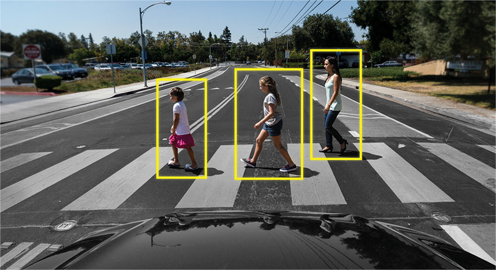

Существует множество архитектур нейронных сетей для определения объектов. В основном, они подразделяются на «двухуровневые», такие как RCNN, fast RCNN и faster RCNN, и «одноуровневые», такие как YOLO. Список наиболее популярных архитектур:

- **R-CNN**. Можно сказать первая модель для решения данной задачи. Работает как обычный классификатор изображений. На вход сети подаются разные регионы изображения и для них делается предсказания. Очень медленная так как прогоняет одно изображение несколько тысяч раз.
- **Fast R-CNN**. Улучшенная и более быстрая версия R-CNN, работает по похожему принципу, но сначала все изображение подается на вход CNN, потом из полученного внутреннего представления генерируются регионы. Но по прежнему довольно медленная для задач реального времени.
- **Faster R-CNN**. Главное отличие от предыдущих в том, что вместо selective search алгоритма для выбора регионов использует нейронную сеть для их «заучивания».
- **YOLO**. Совсем другой принцип работы по сравнению с предыдущими, не использует регионы вообще. Наиболее быстрая. Более подробно о ней пойдет речь в статье.
- **SSD**. По принципу похожа на YOLO, но в качестве сети для извлечения признаков использует VGG16. Тоже довольная быстрая и пригодная для работы в реальном времени.
- **Feature Pyramid Networks (FPN)**. Еще одна разновидность сети типа Single Shot Detector, из за особенности извлечения признаков лучше чем SSD распознает мелкие объекты.
- **RetinaNet**. Использует комбинацию FPN+ResNet и благодаря специальной функции ошибки (focal loss) дает более высокую точность (аccuracy).

"Двухуровневые" архитектуры используют так называемые регионы на картинке (от англ. *Region of Interest*), чтобы определить, находится ли в этом регионе определенный объект. Здесь используется такой примерный алгоритм с ипользованием двух нейронных сетей: 
- прогон картинки через CNN для определения карты признаков;
- поиск тех самых регионов с объектами на картинке отдельной нейронной сетью; 
- сжатие найденных регионов с помощью *RoI pooling* и их подача в следующую нейронную сеть для определения класса объекта внутри региона.


Такие нейронные сеть не смотрят на картинку полностью, а только на отдельные регионы. Также работают они относительно медленно.

В данной статье мы будем использовать архитектуру YOLO, а именно её последнюю модификацию YOLOv3.

В чем же крутость YOLO? В том, что эта архитектура не имеет двух проблем свыше, и она доказала неоднократно свою эффективность.

Вообще архитектура YOLO в первых блоках не сильно отличается по «логике блоков» от других детекторов, то есть на вход подается картинка, дальше создаются карты признаков с помощью CNN (в YOLO используется архитектура CNN под названием Darknet-53), затем эти карты признаков анализируются, выдавая на выходе позиции и размеры ограничивающих прямоугольников и классы, которым они принадлежат.

Потребуется разобраться со следующими проблемами:

1) Найти набор данных для обучения и валидации под поставленную задачу
2) Приготовить найденный набор для выбранной модели
3) Выбрать модель для решения задачи Object detection
4) Настроить параметры обучения в аргументах командной строки
5) Запустить проверку обученной модели на выбранной видеозаписи

Итак, поехали!

### Настройка окружения <a name="5_4_0"></a>

Настройка собственного окружения для работы над проектом требуется из-за специфики мира Python и его зависимостей или пакетов, версий которых (даже для одного пакета) существует бесчисленное множество. Поэтому желательно иметь набор зависиместей исключительно под тот проект, над которым сейчас ведется разработка, и нежелательно засорять системное хранилище зависимостей. Простой пример: в ОС может вестись работа над несколькими проектами, каждый из которых не только использует один и тот же пакет разных версий, но и не может работать с пакетом иной версии. 

- Установить окружение ```conda create --name py35 python=3.5```
- Зайти в окружение ```source activate py35```
- Выйти из окружения ```source deactivate```
- итд [CONDA CHEAT SHEET](https://docs.conda.io/projects/conda/en/4.6.0/_downloads/52a95608c49671267e40c689e0bc00ca/conda-cheatsheet.pdf "Шпаргалка по conda")

Можно использовать ```pyenv``` - выбирать вам (процесс установки зависимостей будет немного отличаться).

### Поиск набора данных <a name="5_4_1"></a>

Нашим набором данных для тренировки и валидации будет является массив изображений людей (Person) и рюкзаков (Backpack). 

Популярным источником изображений для формирования собственного набора данных является [Open Images Dataset](https://storage.googleapis.com/openimages/web/index.html "Набор данных тут"). 

Наборы данных по категориям можно посмотреть тут [Поиск изображений по категориям](https://storage.googleapis.com/openimages/web/visualizer/index.html?set=train&type=segmentation&r=false&c=%2Fm%2F0cyhj_ "Тут можно найти апельсины").

К сожалению, данный источник не предоставляет какого-то удобного инструмента для загрузки исключительно требуемых категорий изображений.

Решить эту проблему нам поможет следующий репозиторий на GitHub: [OIDv4 ToolKit](https://github.com/EscVM/OIDv4_ToolKit/ "Инструмент юного кастомайзера датасетов").

Требуется ознакомиться с документацией в этом репозитории, а именно: Какая структура папок после загрузки требуемых категорий изображений?

Для загрузки наборов данных (Person и Backpack) выполните следующую команду (также обратите внимани на документацию параметров командной строки):

```python3 main.py downloader --classes Person Backpack --type_csv validation```

И следуйте инструкциям на экране (подсказка: соглашайтесь на все :-) ).

Вопрос с набором данных решен! (нет)

### Подготовка набора данных <a name="5_4_3"></a>

Для обучения модели необходимо подготовить данные.
Оригинальная директория с набором данных выглядит следующим образом:

```
- Dataset
  - validation
    - Backpack
      - Label
        - 123.txt
        - 456.txt
        - …
      - 123.jpg
      - 456.jpg
```
*Backpack* - класс изображений

Файлы папки *Labels* содержат следующую информацию об ограничивающих прямоугольниках в каждом изображении:

`<номер класса> <x> <y> <длина прямоугольника> <ширина прямоугольника> `

*x, y* - координаты середины прямоугольника относительно реального размера изображения.
Длина и ширина прямоугольника также даны относительно реального размера изображения.

Директорию с данными нужно привести к следующему виду:

```
- dataset
  - images
    - 123.jpeg
    - 456.jpeg
    - …
  - labels
    - 123.txt
    - 456.txt
    - …
  - train.txt
  - valid.txt
```

Папка *images* содержит набор данных, который будет подаваться на вход модели во время ее обучения или валидации.
Папка *labels* содержит текстовые файлы, названия которых соответствуют названиям набора данных из папки *images*. Эти файлы должны содержать следующую информацию о каждом ограничивающем прямоугольнике в отдельной строке файла:

`<Название класса> <x1> <y1> <x2> <y2>`

*x1, y1, x2, y2* - координаты ограничивающего прямоугольника. Диапазон координат - [0, 1].

В скачанном датасете информация об ограничивающих прямоугольниках не нормализована, то есть координаты ограничивающих прямоугольников даны относительно настоящего размера изображения. В данном случае эти данные нужно нормализовать.

Пример: `Backpack 0.4577515 0.486005 0.915503 0.971942`.

Файлы *train.txt* и *valid.txt* содержат в каждой отдельной строке полный путь от корня до изображений из папки *images* для процессов тренировки и валидации модели соответственно.

Например, в файле train.txt (valid.txt аналогично): `/Users/user/Documents/hackaton/data/dataset/images/73a95027d155bb92.jpg`

### Выбор модели <a name="5_4_2"></a>

Довольно популярным (хотя уже и старым) решением задачи Object Detection является проект YOLO.

- Официальный веб-сайт: https://pjreddie.com/darknet/yolo/
- Научная публикация с описанием модели: https://arxiv.org/pdf/1804.02767v1.pdf
- Исходный код для обучения, валидации и тестирования модели: https://github.com/eriklindernoren/PyTorch-YOLOv3/ 

Небольшое отступление (необязательно к прочтению):
> На самом деле история проекта очень мудреная.

> История проекта описана здесь: 
> https://medium.com/towards-artificial-intelligence/yolo-v5-is-here-custom-object-detection-tutorial-with-yolo-v5-12666ee1774e 

> Официально существует всего 3 версии YOLO (со ссылками на научные публикации):
> - YOLOv1 (https://arxiv.org/pdf/1506.02640.pdf)
> - YOLOv2 (https://arxiv.org/pdf/1612.08242.pdf) 
> - YOLOv3 (https://arxiv.org/abs/1804.02767v1)

> После третьей версии автор проекта остановил разработку, предложив сообществу развивать проект в свободном от него формате. Таким образом, неофициально сущесвует еще 2 версии YOLO:
> - YOLOv4 (https://arxiv.org/pdf/2004.10934)
> - YOLOv5 (https://github.com/ultralytics/yolov5) 

Почему YOLO? Да потому что YOLO считается эффективнее многих других алгоритмов для определения объектов. 

Основная идея YOLO сделать за один проход классификацию того, что может быть на картинке, а потом впаять BB (bounding boxes). Таким образом, мы можем использовать любую архитектуру классификатора, как-то подготовленную для YOLO.

YOLO или You Only Look Once — это очень популярная на текущий момент архитектура CNN, которая используется для распознавания множественных объектов на изображении.

Главная особенность этой архитектуры по сравнению с другими состоит в том, что большинство систем применяют CNN несколько раз к разным регионам изображения, в YOLO CNN применяется один раз ко всему изображению сразу. Сеть делит изображение на своеобразную сетку и предсказывает bounding boxes и вероятности того, что там есть искомый объект для каждого участка.

Плюсы данного подхода состоит в том, что сеть смотрит на все изображение сразу и учитывает контекст при детектировании и распознавании объекта. Так же YOLO в 1000 раз быстрее чем R-CNN и около 100x быстрее чем Fast R-CNN. В данной статье мы будем запускать сеть на мобильном устройстве для онлайн обработки, поэтому это для нас это самое главное качество.

YOLO (You Only Look Once) несет в себе философию смотреть на картинку один раз, и за этот один просмотр (то есть один прогон картинки через одну нейронную сеть) делать все необходимые определения объектов. Как это происходит?

Итак, на выходе от работы YOLO мы обычно хотим вот это:


Что делает YOLO когда учится на данных (простыми словами):

**Шаг 1**: Обычно картинки решейпят под размер 416x416 перед началом обучения нейронной сети, чтобы можно было их подавать пакетами (для ускорения обучения).

**Шаг 2**: Делим картинку (пока что мысленно) на клетки размером axa. В YOLOv3-4 принято делить на клетки размером 13x13.

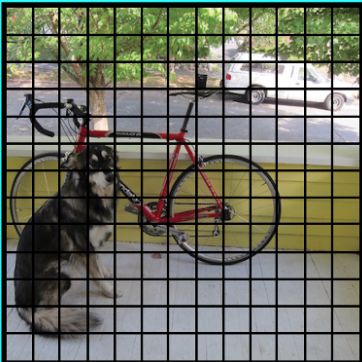

Теперь фокусируемся на эти клеточках, на которые мы разделили картинку/кадр. Такие клетки, которые называются grid cells, лежат в основе идеи YOLO. 
Каждая клетка является «якорем», к которому прикрепляются ограничивающие прямоугольники. 
То есть вокруг клетки рисуются несколько ограничивающих прямоугольников для определения объекта (поскольку непонятно, 
какой формы прямоугольник будет наиболее подходящим, их рисуют сразу несколько и разных форм), и их позиции, ширина и высота вычисляются относительно центра этой клетки.


Как же рисуются эти ограничиваюшие прямоугольники (bounding boxes) вокруг клетки? 
Как определяется их размер и позиция? 
Здесь в борьбу вступает техника anchor boxes (в переводе — якорные коробки, или «якорные прямоугольники»). 
Они задаются в самом начале либо самим пользователем, либо их размеры определяются исходя из размеров bounding boxes, 
которые есть в датасете, на котором будет тренироваться YOLO (используется K-means clustering и IoU для определения самых подходящих размеров). 
Обычно задают порядка 3 различных anchor boxes, которые будут нарисованы вокруг (или внутри) одной клетки:

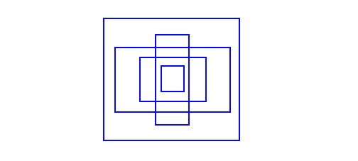

Зачем это сделано? Сейчас все будет понятно, так как мы обсудим то, как YOLO обучается.

**Шаг 3**. Картинка из набора данных прогоняется через нашу нейронную сеть 
(кроме картинки в тренировочном наборе у нас должны быть определенны позиции и размеры настоящих ограничивающих прямоугольников для объектов, которые есть на ней. Это называется «аннотация» и делается это в основном вручную).

Давайте теперь подумаем, что нам нужно получить на выходе.

Для каждой клетки, нам нужно понять две принципиальные вещи:

Какой из anchor boxes, из 3 нарисованных вокруг клетки, нам подходит больше всего и как его можно немного подправить для того, чтобы он хорошо вписывал в себя объект
Какой объект находится внутри этого anchor box и есть ли он вообще

Какой же должен быть тогда output у YOLO?

1) На выходе для каждой клетки мы хотим получить:

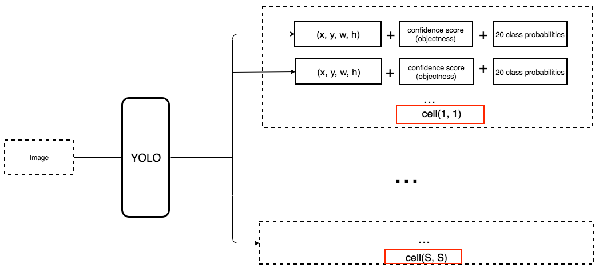

2. Output должен включать в себя вот такие параметры:

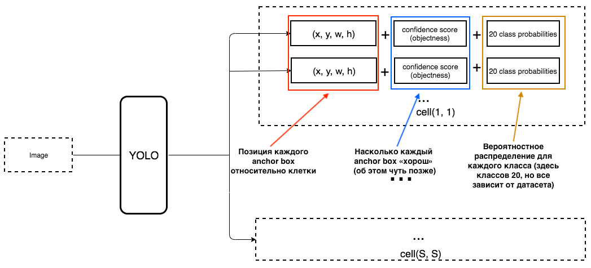

Как определяется objectness? На самом деле этот параметр определяется с помощью метрики IoU во время обучения. Метрика IoU работает так:

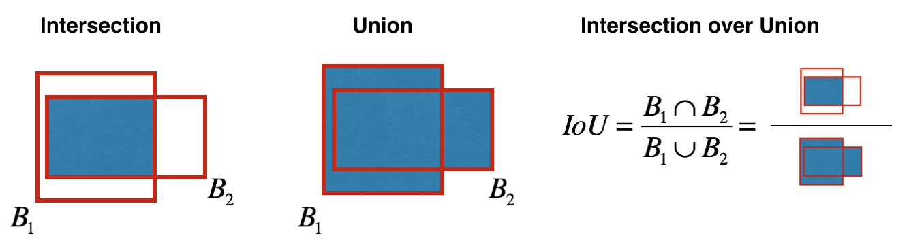

В начале Вы можете выставить порог для этой метрики, и если Ваш предсказанный ограничивающий прямоугольник будет выше этого порога, то у него будет objectness равной единице, 
а все остальные ограничивающие прямоугольники, у которых objectness ниже, будут исключены. Эта величина objectness понадобится нам, когда мы будем считать общий confidence score (на сколько мы уверены, что это именно нужный нам объект расположен внутри предсказанного прямоугольника) у каждого определенного объекта.

А теперь начинается самое интересное. Представим, что мы создатели YOLO и нам нужно натренировать ее на то, чтобы распознавать людей на кадре/картинке. 
Мы подаем картинку из датасета в YOLO, там происходит feature extraction в начале, а в конце у нас получается CNN слой, который рассказывает нам о всех клеточках, на которые мы «разделили» нашу картинку. 
И если этот слой рассказывает нам «неправду» о клеточках на картинке, то у нас должен быть большой Loss, чтобы потом его уменьшать при подаче в нейронную сеть следующих картинок.

YOLO предсказывает 5 параметров (для каждого anchor box для определенной клетки):

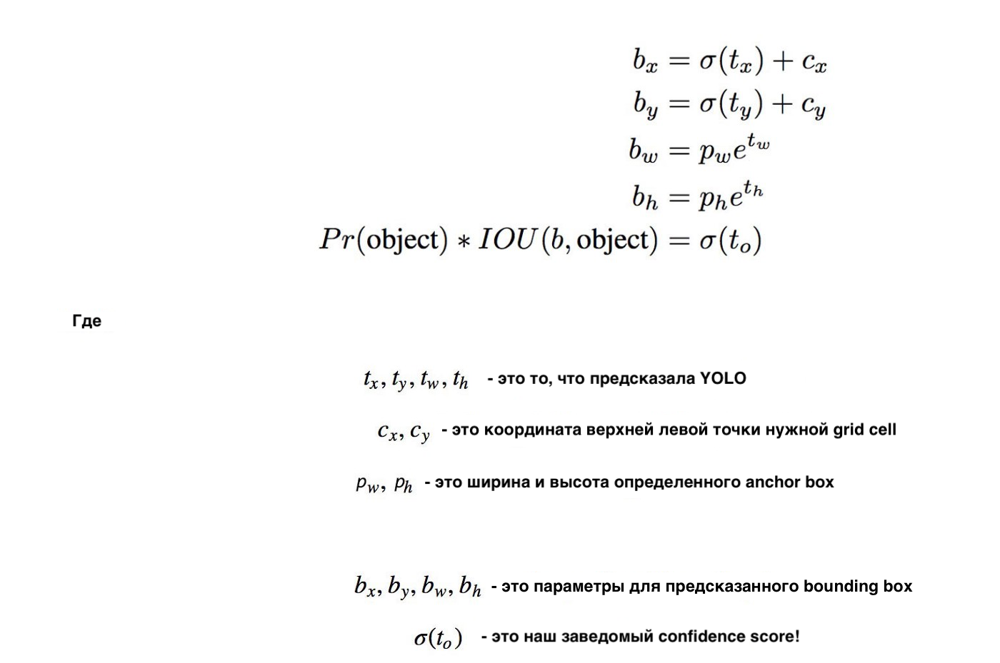

Чтобы было легче понять, есть хорошая визуализация на эту тему:


Как можно понять их этой картинки, задача YOLO — максимально точно предсказать эти параметры, чтобы максимально точно определять объект на картинке. 
А confidence score, который определяется для каждого предсказанного ограничивающего прямоугольника, является неким фильтром для того, чтобы отсеять совсем неточные предсказания. 
Для каждого предсказанного ограничивающего прямоугольники мы умножаем его IoU на вероятность того, что это определенный объект 
(вероятностное распределение рассчитывается во время обучения нейронной сети), берем лучшую вероятность из всех возможных, 
и если число после умножения превышает определенный порог, то мы можем оставить этот предсказанный ограничивающий прямоугольник на картинке.

Дальше, когда у нас остались только предсказанные bounding boxes с высоким confidence score, наши предсказания (если их визуализировать) могут выглядеть примерно вот так:

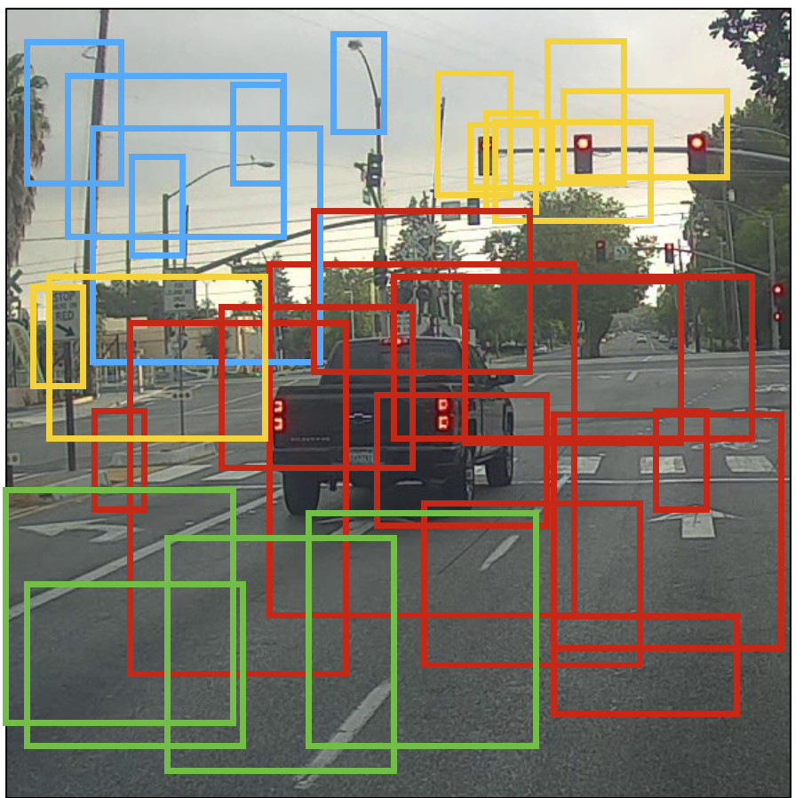

Мы можем теперь использовать технику NMS (non-max suppression), чтобы отфильтровать ограничивающие прямоугольники таким образом, чтобы для одного объекта был только один предсказанный ограничивающий прямоугольник.

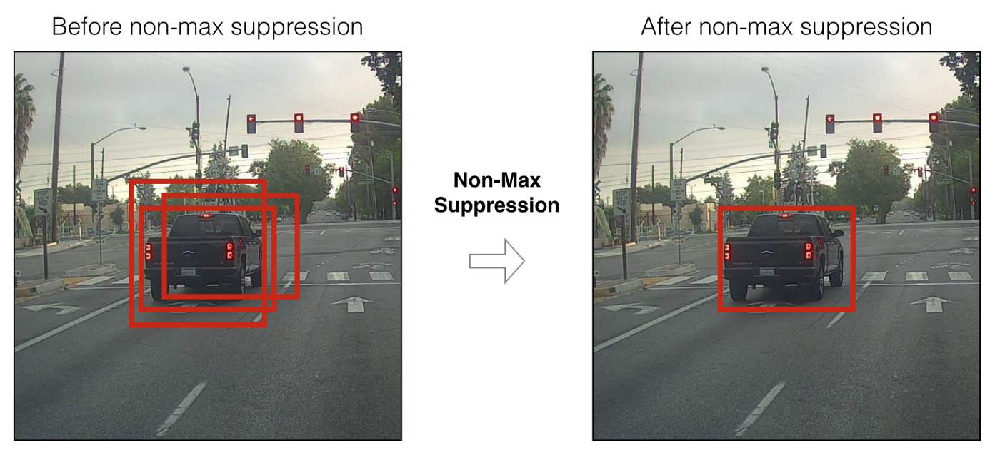

Нужно также знать, что YOLOv3-4 предсказывают на 3-х разных скейлах. То есть картинка делится на 64 grid cells, на 256 клеток и на 1024 клетки, чтобы также видеть маленькие объекты. Для каждой группы клеток алгоритм повторяет необходимые действия во время предсказания/обучения, которые были описаны сверху.

Исходники модели для обучения находят в следующем репозитории на GitHub: [skynet-dl/PyTorch-YOLOv3](https://github.com/skynet-dl/PyTorch-YOLOv3.git "Моделька для детекшена") как форк с небольшими изменениями от официальной реализации для PyTorch [eriklindernoren/PyTorch-YOLOv3](https://github.com/eriklindernoren/PyTorch-YOLOv3.git "Офишиал моделька для детекшена").

Для начала потребуется установить все требуемые зависимости, для этого запустите 2 команды:

1) `conda install --force-reinstall -y -c conda-forge --file requirements.txt`
2) `conda install pytorch torchvision torchaudio cudatoolkit=10.2 -c pytorch`

Далее редактируем следующие файлы для настройки обучения на подготовленном наборе данных:
- `PyTorch-YOLOv3/config/custom.data` - указываем количество классов (2 - Person и Backpack), прописываем пути (относительные или абсолютные) к ранее описанным файлам `train.txt` и `valid.txt`, прописываем путь к файлу с именами классов
- `PyTorch-YOLOv3/config/custom.names` - прописываем на отдельных строчках названия классов `BAG` и `PERSON` (Внимание: номер строчки с название соответсвует номеру класса `BAG`<=>0, `PERSON`<=>1)

И вызываем скрипт `PyTorch-YOLOv3/config/create_custom_model.sh` с параметром `2` (параметр соотвествует количеству классов - Person и Backpack) для настройки парамтров слове модели для обучения.

### Настройка параметров обучения <a name="5_4_4"></a>

Пример команды запуска начала обучения:

`python3 train.py --model_def config/yolov3-custom.cfg --data_config config/custom.data --epochs 500 --batch_size 6 --n_cpu 100 --checkpoint_interval 50 --evaluation_interval 50`

Основные параметры:

- `--model_def config/yolov3-custom.cfg` - конфигурация слоев модели
- `--data_config config/custom.data` - настройки обучения (количество классов, основные пути)
- `--epochs 500` - количество эпох до конца обучения
- `--batch_size 6` - размер пакета изображений из тренировочного набора данных
- `--n_cpu 100` - количество потоков для загрузки пакета изображений
- `--checkpoint_interval 50` - частота сохранений текущего состояния обученной модели (папка сохранения - `PyTorch-YOLOv3/checkpoints`)
- `--evaluation_interval 50` - частота проверки текущего состояния модели во время обучентя

Во время обучения можно следить за измнением большого числа параметров точности и потерь при обучении (с параметрами можно ознакомиться самостоятельно из статей).
Основными параметрами для наблюдения являются суммарный `Loss` и `Precision` на каждом из 3 слоев модели (здесь имеется ввиду архитектурные слои).

Для этого запускается утилита Tensorboard:

> #####Track training progress in Tensorboard:
> Initialize training   
> Run the command below     
> Go to http://localhost:6006/  
> `$ tensorboard --logdir='logs' --port=6006`

Если обучение запускается на удаленном сервере, то можно сделать мост до удаленного `localhost:6006`.
Для этого можно использовать команду: `ssh -N -f -L localhost:6006:localhost:6006 <user>@<ip>`

Таким же образом можно запускать jupyter notebook с отображением на персональном ноутбуке.

### Проверка обученной модели <a name="5_4_5"></a>

Пример команды проверки обученной модели на видеоролике:

`python3 detect_video.py --vedio_file ../video/videoplayback3.mp4 --model_def config/yolov3-custom.cfg --weights_path ./yolov3_ckpt_200d.pth --class_path config/custom.names`

Основные параметры:

- `--vedio_file ../video/videoplayback3.mp4` - путь к видеофайлу
- `--model_def config/yolov3-custom.cfg` - путь к конфигурации слоев обученной модели
- `--weights_path ./yolov3_ckpt_200d.pth` - путь к обученным весам модели
- `--class_path config/custom.names` - путь к списку классов для поиска

После окончания работы скрипта в корне появится видеофайл `output.avi` с разметкой объектов в видеопотоке.

Конец!

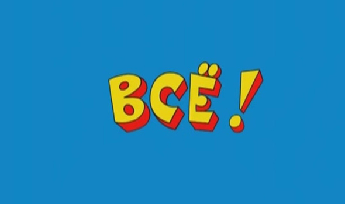

### Конец? <a name="5_4_6"></a>

Мы как авторы этого дня, Сергей Малышев и Руфина Абдурахманова, успели получить первые результаты, буквально готовя для вас документацию и стенд. И хотим рассказать с чего все началось, с какими проблемами мы столкнулись и что из этого получилось!

Как было описано выше (да и вообще в сети), YOLO все еще остается как довольно популярным подходом для Object Detection,
так и довольно простым инструментом проверить гипотезы поставленной задачи - Tesla Autopilot, запилить не получится. :-) Большинство таких популярных моделей уже имеют предобученные части на огромных наборах данных, включающих в себя тысячи классов.
Их можно использовать для тюнинга или подгонки всей модели для поставленной задачи. Но наша задача нетривиальная: всего 2 класса, один из которых не очень популярный (если судить по размерам доступных наборов данных) - люди и чемоданы.
Это сразу заставляет начать обучение с абсолютного нуля, с кастомным набором данных для тренировки и валидации. Вопрос с данными был решен ровно также как и в секции выше. Но были ошибочные попытки сделать то, чего делать не стоило.

Ресурс Open Images Dataset содержит около 800000 изображений для классов Person, Man, Woman, Boy, Girl... и всего 10000 изображений чемоданов.
Обучение модели в течение одной эпохи и итоговый результат заставили одуматься.
Отдельная проблема заключалась в подготовке данных - копирование и перезапись безумно огромного числа файлов - долгий процесс. И к сожалению нас это не остановило.
Были применены все возмодные оптимизации на уровнях языка Python, ОС и параллелизации. **Наилучшим случаем было бы, если количество изображений для каждого класса должно быть примерно одинаковым.** 
Тогда качество обучения можно оценить буквально на 10000 изображениях на класс.

Обучение сверточных нейронных сетей - это как набор данных, так и гиперпараметры сети (скорость обучение, количесво эпох, ширина и глубина слоев и так далее). Если на малом объеме наблюдается успешное обучение, то это, конечно, означает, что допустимо увеличить размер набора данных.
**Надеяться только на набор данных является ошибочным подходом.**

Таким образом мы сформировали и подготовили корректный для поставленной задачи набор данных (суммарно около 15000 изображений),
и получили спустя 450 эпох обучения первые результаты... уверен можно лучше! :-)

Чекпоинт модели после 450 эпох: https://drive.google.com/drive/folders/1ujKHGhAvRaGCnkfmnQ4S2IhDSjNxLEWy?usp=sharing

Видео для проверки обученной модели: https://www.youtube.com/watch?v=H7acaFnXKz0

Содержимое `custom.names`:
```
BAG
PERSON
```

Результат проверки: https://drive.google.com/drive/folders/1A9EB6iI6WBLr6WbwFRgEGipvTbL55a-u?usp=sharing

Скриншот:

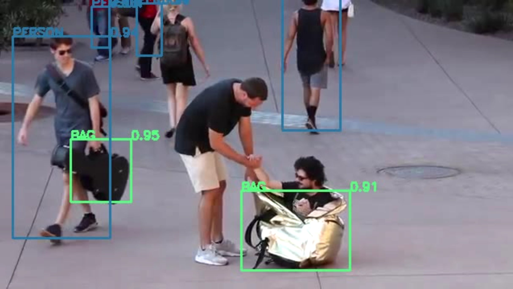

### Источники <a name="5_4_7"></a>

1) Object detection and tracking in PyTorch - https://towardsdatascience.com/transfer-learning-from-pre-trained-models-f2393f124751

2) Training Yolo for Object Detection in PyTorch with Your Custom Dataset — The Simple Way - https://towardsdatascience.com/training-yolo-for-object-detection-in-pytorch-with-your-custom-dataset-the-simple-way-1aa6f56cf7d9

3) Open Images Dataset V6 + Extensions - https://storage.googleapis.com/openimages/web/index.html

4) OIDv4 ToolKit - https://github.com/EscVM/OIDv4_ToolKit/

5) PyTorch-YOLOv3 - https://github.com/eriklindernoren/PyTorch-YOLOv3/

6) You Only Look Once: Unified, Real-Time Object Detection - https://arxiv.org/pdf/1506.02640.pdf

7) YOLO: Real-Time Object Detection - https://pjreddie.com/darknet/yolo/

8) YOLO9000: Better, Faster, Stronger - https://arxiv.org/pdf/1612.08242.pdf

9) YOLO: Real-Time Object Detection - https://pjreddie.com/darknet/yolov2/

10) YOLOv3: An Incremental Improvement - https://arxiv.org/pdf/1804.02767v1.pdf

11) Как работает Object Tracking на YOLO и DeepSort - https://habr.com/ru/post/514450/

12) Самая сложная задача в Computer Vision - https://habr.com/ru/company/recognitor/blog/505694/

13) Распознавание объектов в режиме реального времени на iOS с помощью YOLOv3 - https://habr.com/ru/post/460869/

14) Transfer learning from pre-trained models - https://towardsdatascience.com/transfer-learning-from-pre-trained-models-f2393f124751

15) Object Detection and Tracking in 2020 - https://blog.netcetera.com/object-detection-and-tracking-in-2020-f10fb6ff9af3

16) Обзор алгоритмов трекинга объектов / Дмитрий Акимов //Video Group CS MSU Graphics & Media Lab - https://www.compression.ru/video/seminar/slides/2012_object_tracking_methods_review.pdf

