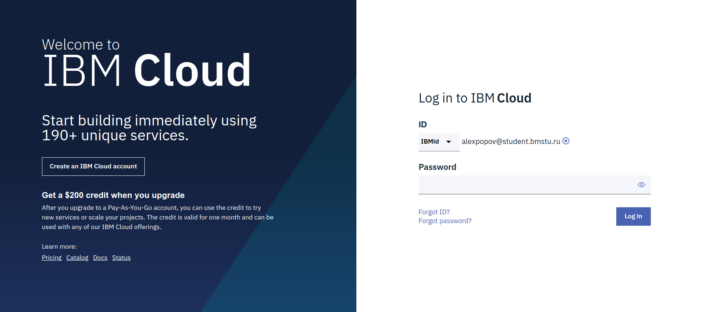
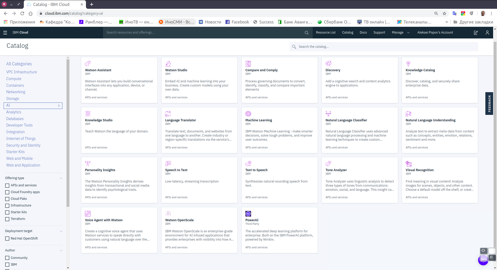

****
# День 4. Компьютерное зрение 

В этом задании мы рассмотрим средства и алгоритмы компьютерного зрения и решим задачу распозавания объектов на серии фотографий. 

Для вычислений мы будем исопльзовать платформу IBM Watson Studio, доступную студентам и преподаватеям МГТУ по академической программе IBM.

Набор средств машинного обучения и анализа данных Watson Studio очень широк и позволяет решать задачи ИИ, в том числе с использованием распределенных вычислений и GPGPU.

Для выбора средст машинного обучения для решения практических задач следует ознакомиться с инструкцией: [Choosing a tool in Watson Studio](https://dataplatform.cloud.ibm.com/docs/content/wsj/getting-started/tools.html?audience=wdp&context=wdp)

## Регистрация в IBM Cloud и получение студенческого промо-кода 

Для доступа к ресурсам IBM Watson Studio необходимо:

- Получить почтовый адрес из домена `@student.bmstu.ru` или `@bmstu.ru`. Инструкция по получению почтового адрес из домена `@student.bmstu.ru` находится [тут](https://mail.bmstu.ru/~postmaster/mail_for_students_and_aspirants.pdf).

- Пройти регистрацию на облачной платформе IBM Cloud, используя почтовый адрес `@student.bmstu.ru` или `@bmstu.ru`.

- Пройти регистрацию в программе Академической инициативе по адресу [ibm.biz/academic](ibm.biz/academic)

- Получить бесплатный студенческий промо-код, дающий возможность использовать расширенные ресурсы IBM Cloud в течении 6 месяцев.

- Зарегистрировать промо код в вашем аккоунте IBM Cloud (инструкция доступна на странице заказа промо-кода). 

Доступ к платформе осуществляется по адресу [cloud.ibm.com](https://cloud.ibm.com).

**Облачная платформа PaaS IBM Cloud**

**Дополнительные источники литературы по данному разделу:**

- [Описание ресурсов IBM Cloud](https://www.ibm.com/ru-ru/cloud)

## Облачная платформа *IBM Cloud* 

***IBM Cloud*** — это открытое облачная система типа PaaS
(*Platform-as-a-Service*) на базе проекта с открытым исходным кодом Cloud Foundry. Эта платформа предназначена для разработки и хостинга приложений, а также упрощения задач по управлению инфраструктурой. Она позволяет быстро создавать и развертывать приложения, а также управлять ими.

***IBM Cloud*** обеспечивает следующие возможности:

-   быстрое и инкрементное составление приложений из сервисов;
-   непрерывное внесение изменений в приложения и обеспечение постоянной доступности;
-   поддержка высокоспециализированных моделей программирования и сервисов для конкретных рабочих нагрузок;
-   встраивание высокой степени управляемости в сервисы и приложения;
-   оптимизация и эластичная адаптация к рабочей нагрузке.

**Каталог компонентов IBM Cloud**

Платформа *IBM Cloud* достигает этих целей посредством абстрагирования и скрытия большинства сложностей, традиционно сопутствующих хостингу приложений в облаке и управлению ими в облачной среде. *IBM Cloud* может быть использована разработчиками для создания и применения самых разных приложений, включая веб-приложения, мобильные приложения, приложения для работы с большими данными, приложения для разумных устройств и т.д. *IBM Cloud* поддерживает разработку на популярных языках программирования и средах разработки. Java-технологии, средства создания серверных частей для мобильных приложений, мониторинг приложений, технологии с открытым исходным кодом и т. д. — все эти возможности
доступны в облаке как сервисы.

Каталог *IBM Cloud* содержит большую часть из того, что необходимо для быстрого начала работы, большое количество шаблонов, заранее сконфигурированны наборов сервисов, сред исполнения и примеров кода, готовых к использованию:

-   инструментов и библиотек обработки данный: R Studion, Jupyter Notebooks, Streams flow editor, SPSS Modeler, Spark MLlib modeler, Decision Optimization model builder и других;
-   сред исполнения, в том числе: Liberty for Java, Node.js, Ruby on Rails;
-   веб-сервисов и сервисов приложений, в том числе: Data/Session Cache,  ElasticMQ, Decision, SSO, Log Analysis, Redis, RabbitMQ, Twilio;
-   мобильных сервисов, в том числе: push-уведомлений, Cloud Code,     Mobile Application Management, Mobile Quality Assurance;
-   сервисов управления данными, в том числе: MongoDB, реляционной базы данных от IBM, JSON-базы данных от IBM, MySQL, PostgreSQL, MobileData, Mobile Sync, BLU Data Warehouse, MapReduce;
-   сервисов мониторинга и анализа;
-   сервисов DevOps Services (прежнее название: JazzHub).
-   проприетарные сервисы IBM, включая аналитическую систему SPSS и другие. 
-   когнитивные сервисы IBM Watson.

****
### Краткое описание концепций *IBM Cloud* 

В терминологии *IBM Cloud* приложение (*application*) — это созданный вами артефакт, т. е. весь программный код (исходный код или исполняемые двоичные файлы), который необходимо запустить или на который необходимо сослаться в процессе исполнения. Мобильные приложения выполняются за пределами среды *IBM Cloud* и используют сервисы *IBM Cloud*, представленные приложениями. В случае веб-приложений приложение — это код, загруженный на платформу *IBM Cloud* с целью хостинга. Кроме того, платформа *IBM Cloud* способна осуществлять хостинг программного кода приложения, который вы хотите выполнять на внутреннем сервере в среде на базе контейнера.

На рисунке показаны принципы взаимодействия *IBM Cloud* с клинтскими приложениями.

**Принципы взаимодействия *IBM Cloud* с клинтскими приложениями**

***Сервис (service)*** — это код, работающий на платформе *IBM Cloud* и предлагающий некоторую функциональность, которую могут использовать приложения. Это может быть готовый сервис, используемый непосредственно — например, push-уведомления для мобильных приложений или эластичное кэширование для веб-приложения. Вы также можете создавать собственные сервисы в диапазоне от простых служебных функций до сложной
бизнес-логики.

***Организация (organization) и пространство (space)*** — это организационные единицы инфраструктуры, способные хранить и отслеживать ресурсы приложения. Организация содержит домены (domain), пространства и пользователей. Пространство содержит приложения и сервисы. По умолчанию используется три пространства: Development (разработка), Production (производство) и Staging (подготовка). Для приложений, которым требуется среда типа PaaS, предоставляются buildpack-пакеты, каждый из которых представляет собой набор скриптов для подготовки кода к исполнению на целевой PaaS-платформе. Buildpack-пакеты, которые включают необходимую вашим приложениям среду исполнения и могут также содержать специализированные инфраструктуры, упрощают развертывание приложения в облаке по сравнению с самостоятельной установкой и конфигурированием среды исполнения.

Использование сервисов в *IBM Cloud* включает три этапа:
1.  Сообщите платформе *IBM Cloud*, что вам требуется новый экземпляр сервиса и какое конкретное приложение будет использовать этот новый экземпляр.
2.  *IBM Cloud* автоматически инициализирует новый экземпляр этого сервиса и свяжет его с приложением.
3.  Приложение взаимодействует с сервисом.

***Пакеты сервисов (Service bundles)*** — это коллекции API-интерфейсов, используемых в конкретных областях. Например, пакет Mobile Services включает сервисы MobileData, Cloud Code, Push и Mobile Application Management. Доступные сервисы и среды исполнения представлены в каталоге IBM Cloud. Кроме того, вы можете зарегистрировать собственные сервисы.

****
### Развертывание и управление приложением 

Чтобы развернуть свое приложение, необходимо загрузить его в среду *IBM Cloud* и указать, сколько экземпляров этого приложения должно исполняться, а затем сконфигурировать *IBM Cloud*, введя необходимую информацию для поддержки этого приложения.

В случае мобильного приложения среда *IBM Cloud* содержит артефакт, который представляет серверную часть мобильного приложения — набор сервисов, который использует приложение для взаимодействия с сервером. *IBM Cloud* поддерживает серверные компоненты мобильного приложения, взаимодействующие с сервисами PushWorks, Cloud Code и Mobile Data, непосредственно из пользовательского интерфейса *IBM Cloud*.

В случае веб-приложения необходимо предоставить в *IBM Cloud* соответствующую информацию о среде исполнения и среде разработки, чтобы платформа смогла сформировать надлежащую инфраструктуру для исполнения этого приложения.

При развертывании приложений и управлении ими можно использовать инструмент командной строки cf, веб-интерфейс *IBM Cloud* или сервисы DevOps Services.

Браузерные и мобильные клиенты — а также другие приложения, развернутые на платформе *IBM Cloud* и выполняющиеся за ее пределами — взаимодействуют с приложениями, работающими на платформе *IBM Cloud*, через API-интерфейсы типа REST/HTTP. Каждый клиентский запрос маршрутизируется к одному из экземпляров приложения или составляющих его сервисов. Среды исполнения приложений в *IBM Cloud* изолированы друг от друга даже тогда, когда они находятся на одной и той же физической машине.

В ходе управления приложениями можно запускать, останавливать, перезапускать экземпляры приложения (или, в случае веб-приложения, изменять их количество), а также изменять объем памяти, используемый приложением. Ключевая конструктивная особенность *IBM Cloud* — отличные показатели при хостинге масштабируемых приложений и артефактов приложений. На данный момент эта платформа не масштабирует приложение автоматически в соответствии с нагрузкой, поэтому этим процессом необходимо управлять самостоятельно посредством создания или удаления экземпляров при изменении рабочей нагрузки. По этой причине ваши приложения должны сохранять все персистентные данные за пределами приложения в одном из сервисов хранения данных, предоставляемых платформой *IBM Cloud*. При повторном развертывании приложения после обновления используется тот же процесс, что и при начальном развертывании. *IBM Cloud* останавливает все исполняющиеся экземпляры и переводит новые экземпляры в рабочее состояние автоматически.

